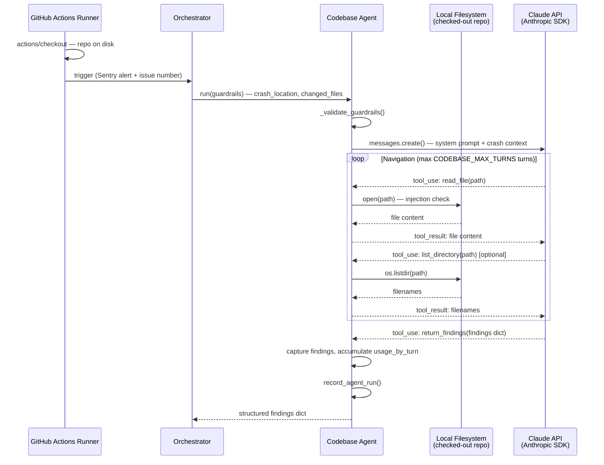

# D.5 — Codebase Agent Spec

**Status: DRAFT — awaiting sign-off**
**Architecture doc sections:** `Codebase Agent Query Contract`, `Agent Catalog`, `Principles`, `Codebase Agent Findings Schema`
**Dependency map:** `agents/specs/DEPENDENCY_MAP.md`

---

## What this slice builds

A Claude-assisted codebase navigator (`agents/codebase_agent.py`) that receives a crash location and list of changed files from the Orchestrator, then iteratively reads the filesystem to trace the root cause. Claude drives navigation — deciding what to read next — until the root cause is found or the turn budget is exhausted. Returns a structured findings dict (~50 tokens) to the Orchestrator. Zero interpretation, zero raw code snippets.

This is the first agent in the pipeline to make real Anthropic SDK calls. `usage_by_turn` is accumulated from every `client.messages.create()` call and passed to `record_agent_run`.

### Where This Agent Runs

Unlike D.1–D.4 (which call external HTTP APIs and can run anywhere), the Codebase Agent reads the local filesystem. It **must run on a GitHub Actions runner where the repository has been checked out**. File paths like `src/hooks/useMenu.ts` resolve relative to the repository root on the runner's local storage — they are physically present because of the `actions/checkout` step.

The only secret this agent requires is `ANTHROPIC_API_KEY`.

### Flow Diagram



---

## Signature

```python
# agents/codebase_agent.py
def run(guardrails: dict, issue_number: str = "") -> dict:
    ...
```

**Guardrails consumed:**

| Key | Type | Source | Notes |
|---|---|---|---|
| `crash_location` | `str \| None` | Sentry extractor findings | File + line where error occurred, e.g. `src/components/MenuItemCard.tsx:42`. `None` for backend errors until task 3.14 (backend Sentry SDK) is complete |
| `endpoint` | `str \| None` | Render logs findings | Backend route that failed, e.g. `/api/menu`. Fallback navigation start when `crash_location` is `None` |
| `changed_files` | `list[str]` | GitHub extractor findings | Files changed in the release that triggered the error |
| `max_files_to_read` | `int` | Orchestrator guardrail | Hard cap on total files Claude may read in one run |

**Navigation start priority:** `crash_location` first (precise file + line); `endpoint` fallback when `crash_location` is `None`. Both `None` → return `no_data`.

---

## Return Shape

Matches `Codebase Agent Findings Schema` in `agent-architecture.md`.

```python
{
    "status": "completed",          # see Exit Conditions for full status set
    "source": "codebase",
    "crash_location":  "src/components/MenuItemCard.tsx:42",
    "root_cause_file": "src/hooks/useMenuItems.ts:23",
    "missing_field":   "price",                         # None if not a missing-field error
    "fix_location":    "graphql/menu.graphql — MenuItem type",
    "fix_type":        "add_field",                     # see Fix Types table below
    "fix_detail":      "Add price: Float! to MenuItem type and populate in useMenuItems hook",
    "runbook_match":   "missing-field-frontend-query",  # None if no match
    "injection_flag":  False,
    "pii_flag":        False,
}
```

**Fix Types:**

| Value | Meaning |
|---|---|
| `add_field` | A field is missing from a type, query, or schema |
| `remove_field` | A field was removed but is still referenced |
| `wrong_value` | A field exists but has an incorrect value or type |
| `missing_import` | A symbol is used but not imported |
| `logic_error` | Incorrect conditional, null check, or computation |
| `config_error` | A config value is missing or misconfigured |

Error statuses return a minimal dict:

```python
{"status": "<status>", "source": "codebase"}
```

---

## Implementation Rules

1. Import `CODEBASE_MODEL`, `CODEBASE_MAX_TURNS`, `CODEBASE_MAX_TOKENS`, `CODEBASE_MAX_FILE_CHARS` from `agents/config.py` — never hardcode.
2. Import `STATUS_COMPLETED`, `STATUS_NO_DATA`, `STATUS_INJECTION_DETECTED`, `STATUS_INVALID_INPUT`, `STATUS_PARTIAL` from `agents/config.py`. Add `STATUS_PARTIAL = "partial"` to `config.py` — it does not exist yet.
3. Import `_INJECTION_RE` from `agents/patterns.py` — used in `_read_file` to guard file content before returning it to Claude.
4. Import `record_agent_run` from `agents/sentry_utils.py` — call before every `return` in `run()`.
5. Import `build_system_prompt` from `agents/prompt_utils.py` — wrap the system prompt for prompt caching.
6. Use `anthropic.Anthropic()` client — do not instantiate inside the loop; create once before the loop.
7. Accumulate `usage_by_turn` after every `client.messages.create()` call — this agent makes real Claude API calls, unlike D.1–D.4.
8. The agentic loop is bounded by `CODEBASE_MAX_TURNS` — never use `while True`.
9. Claude returns findings via a `return_findings` tool call — do not parse free text. Capture the tool args dict as the result.
10. `_read_file` and `_list_directory` are the only filesystem access points — scope enforcement lives in these functions, not in the prompt.
11. No cross-feature imports — shared helpers come only from `patterns.py`, `sentry_utils.py`, `config.py`, `prompt_utils.py`.

---

## Filtering Pipeline

1. **Validate guardrails** — `max_files_to_read` must be a positive int; at least one of `crash_location` or `endpoint` must be a non-empty string. Return `invalid_input` immediately on failure — no Claude call made.
2. **Determine navigation start** — if `crash_location` is provided and in scope, use it. If `crash_location` is `None` or empty, fall back to `endpoint`. If both are absent, return `no_data`. Validate any provided `crash_location` starts with an allowed prefix (`src/`, `graphql-gateway/`, `backend/`, `docs/`).
3. **Build system prompt** — wrap with `build_system_prompt()` for prompt caching. System prompt instructs Claude: navigate read-only, call `return_findings` when done, never return raw code.
4. **Build initial user message** — pass `crash_location`, `changed_files`, and `max_files_to_read` as structured input.
5. **Agentic loop** — each turn: call `client.messages.create()`, append usage to `usage_by_turn`. On `stop_reason == "tool_use"`: dispatch to `_process_tool_call()`. On `stop_reason == "end_turn"` or `return_findings` tool called: exit loop.
6. **Injection guard in tool functions** — `_read_file` checks file content against `_INJECTION_RE` before returning it to Claude. On match: return injection error string to Claude and set `injection_flag = True`; `run()` returns `injection_detected` on next turn.
7. **Turn budget exhausted** — if loop exits without `return_findings` being called, return `status: partial` with whatever partial fields were extracted.

---

## Exit Conditions

| Status | Trigger | Orchestrator action |
|---|---|---|
| `completed` | Claude called `return_findings` with all required fields within turn budget | Pass to Recommendation Agent |
| `partial` | Turn budget (`CODEBASE_MAX_TURNS`) exhausted before `return_findings` called | Pass partial findings to Recommendation Agent with confidence penalty |
| `no_data` | `crash_location` not found in filesystem scope | Skip codebase findings in payload |
| `injection_detected` | `_INJECTION_RE` matched in file content during navigation | Flag on GitHub Issue; stop processing |
| `invalid_input` | Guardrails dict has wrong types or missing required fields | Log misconfiguration; skip codebase findings |

---

## Private Helper Functions

```python
def _validate_guardrails(guardrails: dict) -> str | None:
    # returns error string if both crash_location and endpoint are absent/empty, or max_files_to_read is not a positive int; None if valid

def _is_path_allowed(path: str) -> bool:
    # returns True if path starts with src/, graphql-gateway/, backend/, or docs/

def _read_file(path: str) -> str:
    # scope check via _is_path_allowed; injection check via _INJECTION_RE; content capped at CODEBASE_MAX_FILE_CHARS before returning to Claude

def _list_directory(path: str) -> list[str]:
    # scope check via _is_path_allowed; returns sorted filenames or error string

def _build_tool_definitions() -> list[dict]:
    # returns Anthropic-format tool schemas for read_file, list_directory, and return_findings

def _process_tool_call(tool_name: str, tool_input: dict, files_read: list[str], max_files: int) -> tuple[str, bool]:
    # dispatches tool_name to the correct Python function; enforces max_files cap;
    # returns (result_string, injection_detected_flag)
```

---

## TDD Test Plan

File: `agents/tests/test_codebase_agent.py`

| # | Test name | Category | What it verifies |
|---|---|---|---|
| 1 | `test_returns_completed_when_claude_calls_return_findings` | Happy path | Claude calls `return_findings` → `status="completed"`, `source="codebase"`, all findings fields present |
| 2 | `test_returns_no_data_when_both_locations_absent` | Happy path | Both `crash_location` and `endpoint` absent → `status="no_data"`, no Claude call |
| 3 | `test_returns_partial_when_turn_budget_exhausted` | Happy path | SDK returns `tool_use` for all `CODEBASE_MAX_TURNS` turns without `return_findings` → `status="partial"` |
| 4 | `test_endpoint_fallback_used_when_crash_location_none` | Happy path | `crash_location=None`, `endpoint="/api/menu"` → Claude call made, `endpoint` passed as navigation start |
| 5 | `test_returns_invalid_input_when_both_locations_missing` | Input validation | `guardrails={}` → `status="invalid_input"`, no Claude call |
| 6 | `test_returns_invalid_input_when_max_files_not_int` | Input validation | `max_files_to_read="ten"` → `status="invalid_input"`, no Claude call |
| 7 | `test_returns_invalid_input_when_max_files_negative` | Input validation | `max_files_to_read=-1` → `status="invalid_input"`, no Claude call |
| 8 | `test_returns_no_data_when_crash_location_out_of_scope` | Input validation | `crash_location="etc/passwd"` → `status="no_data"`, no Claude call |
| 9 | `test_missing_api_key_returns_unauthenticated` | Authentication | `ANTHROPIC_API_KEY=""` → `status="unauthenticated"`, no SDK call made |
| 10 | `test_anthropic_401_returns_unauthenticated` | Authentication | SDK raises `anthropic.AuthenticationError` → `status="unauthenticated"` |
| 11 | `test_anthropic_400_returns_invalid_input` | Authentication | SDK raises `anthropic.BadRequestError` → `status="invalid_input"` (malformed tool definition or payload) |
| 12 | `test_anthropic_422_returns_invalid_input` | Authentication | SDK raises `anthropic.UnprocessableEntityError` → `status="invalid_input"` (payload rejected as semantically invalid) |
| 13 | `test_anthropic_403_returns_unauthorized` | Authorization | SDK raises `anthropic.PermissionDeniedError` → `status="unauthorized"` |
| 14 | `test_anthropic_404_returns_invalid_input` | Resource not found | SDK raises `anthropic.NotFoundError` → `status="invalid_input"` (model name in config doesn't exist) |
| 15 | `test_anthropic_429_returns_rate_limited` | Rate limiting | SDK raises `anthropic.RateLimitError` → `status="rate_limited"`, no retry inside agent |
| 16 | `test_anthropic_5xx_returns_server_error` | Server failures | SDK raises `anthropic.InternalServerError` → `status="server_error"` |
| 17 | `test_anthropic_409_returns_server_error` | Server failures | SDK raises `anthropic.ConflictError` → `status="server_error"` (treat as transient) |
| 18 | `test_anthropic_timeout_returns_timeout` | Network failures | SDK raises `anthropic.APITimeoutError` → `status="timeout"` |
| 19 | `test_anthropic_connection_error_returns_network_error` | Network failures | SDK raises `anthropic.APIConnectionError` → `status="network_error"` |
| 20 | `test_missing_stop_reason_returns_schema_error` | Schema validation | SDK response missing `stop_reason` → `status="schema_error"` |
| 21 | `test_missing_usage_returns_schema_error` | Schema validation | SDK response missing `usage` field → `status="schema_error"` |
| 22 | `test_injection_in_file_content_returns_injection_detected` | Filesystem | `_read_file` content matches `_INJECTION_RE` → `status="injection_detected"`, `injection_flag=True` |
| 23 | `test_read_file_blocked_outside_scope` | Filesystem | `_read_file("agents/config.py")` → returns error string, no file opened |
| 24 | `test_list_directory_blocked_outside_scope` | Filesystem | `_list_directory(".env")` → returns error string |
| 25 | `test_file_not_found_returns_error_string_to_claude` | Filesystem | `_read_file` on non-existent path → error string returned to Claude, loop continues |
| 26 | `test_max_files_cap_enforced` | Filesystem | `max_files_to_read=2`, Claude requests 3 reads → third call returns cap error string |
| 27 | `test_usage_by_turn_accumulated` | Observability | Two SDK turns → `record_agent_run` called with `usage_by_turn` of length 2 |
| 28 | `test_record_agent_run_called_on_every_return` | Observability | `record_agent_run` called for `completed`, `partial`, `invalid_input`, `no_data`, `unauthenticated` paths |
| 29 | `test_build_system_prompt_used` | Observability | `build_system_prompt` called — confirms caching wrapper always applied |
| 30 | `test_changed_files_included_in_initial_message` | Observability | `changed_files` from guardrails appears in first user message content |

All Claude SDK calls mocked with `unittest.mock.patch`. No real Anthropic API calls in tests.

---

## Files Touched

| File | Change |
|---|---|
| `agents/codebase_agent.py` | New — implementation |
| `agents/tests/test_codebase_agent.py` | New — 13 TDD tests |
| `agents/config.py` | Add `STATUS_PARTIAL = "partial"` |
| `agents/specs/DEPENDENCY_MAP.md` | Update — add `codebase_agent` row and tool definitions |

---

## Acceptance Criteria

- [ ] All 30 tests green
- [ ] Full test suite green (no regressions — currently 76 tests)
- [ ] No real Anthropic API calls in tests (all mocked)
- [ ] `record_agent_run` called on every return path
- [ ] `build_system_prompt` called — caching wrapper always applied
- [ ] `usage_by_turn` accumulated from every SDK call and passed to `record_agent_run`
- [ ] Filesystem scope enforced in tool functions, not in the prompt
- [ ] No hardcoded values — all config from `agents/config.py`
- [ ] No cross-feature imports

---

## Appendix — Input Token Accumulation: Root Cause and Fix Options

> Written after D.ST.5 smoke test (2026-05-16). The failed run hit **11,000 input tokens**. Read this before starting D.ST.5a.

### Why tokens compound across turns

The Anthropic API requires the full message history on every call. Every file Claude reads is appended as a `tool_result` and re-sent on every subsequent turn — it never leaves the context:

```
Turn 1 input:  [system] + [tools] + [user_message_0]                                          ~535 tokens
Turn 2 input:  [system] + [tools] + [user_message_0] + [assistant_1] + [file1_content]        ~3,185 tokens
Turn 3 input:  [system] + [tools] + [user_message_0] + [assistant_1] + [file1_content]
                + [assistant_2] + [file2_content]                                              ~5,835 tokens
Turn 4 input:  everything above + [assistant_3] + [file3_content]                             ~8,485 tokens
Turn 5 input:  everything above + [assistant_4] + [file4_content]                             ~11,135 tokens
```

Each file read adds **~2,500 tokens** (`CODEBASE_MAX_FILE_CHARS = 10,000 chars ÷ 4`) to **every subsequent turn**, not just the turn it was read.

### Fixed overhead per turn (always re-sent)

| Component | Tokens |
|---|---|
| System prompt | ~35 |
| Tool definitions (3 tools) | ~450 |
| Initial user message | ~50 |
| **Subtotal** | **~535 per turn** |

### Why the failed D.ST.5 run was worse than a clean run

The multi-tool bug (Claude returning 2 `tool_use` blocks, us processing only 1) caused extra turns before the 400 error. Each of those extra turns still appended file content to the history. By the time the 400 hit, 4–5 turns had accumulated — reaching 11k.

A clean 3-turn run with `max_files_to_read: 3` should stay under 4k input tokens.

---

### Three architectural approaches to solve this (decide in D.ST.5a)

#### Option A — Trim old tool_results after processing *(recommended — most general)*

**Correct timing — shrink AFTER getting Claude's response, not after appending.**

Getting a response from the API proves Claude has already read and reasoned about the previous turn's file content. That is the safe moment to shrink — not before.

```
Turn N:
  → client.messages.create() sends messages including full file content from turn N-1
  ← Claude responds (proof it has now read turn N-1's file)
  → shrink ALL previous tool_result contents to stubs  ← correct moment
  → append turn N's assistant response + turn N's full new tool_result
Turn N+1:
  → client.messages.create() sends:
      [system] + [tools] + [initial_msg]
      + [assistant_N-1] + [stub: "read: file1 — N-1 chars"]   ← was 2,500 tokens, now ~10
      + [assistant_N]   + [file_N full content]                ← Claude still needs this
```

```python
# correct placement — right after client.messages.create() succeeds, line ~185
response = client.messages.create(...)

# Claude just responded — it has processed all previous tool_results in this call
# shrink them now so the next call does not re-send large file contents
for msg in messages:
    if msg.get("role") == "user" and isinstance(msg.get("content"), list):
        for block in msg["content"]:
            if isinstance(block, dict) and block.get("type") == "tool_result":
                if len(block.get("content", "")) > 100:
                    block["content"] = f"[read: {len(block['content'])} chars — already in Claude's context]"

# now process tool calls and append new messages as normal
```

**What "already in Claude's context" means — there is no processing logic.**
The stub is not a summary. No code processes or extracts anything from the file. The reason it is safe to discard the content is that Claude's own response (the assistant message we keep in full) already contains whatever Claude extracted from the file — the symbol it found, the line it identified, the pattern it noticed. The file content served its purpose in that turn. Future turns need Claude's analysis of it, not the raw bytes again. The stub just satisfies the API contract (every `tool_use` must have a matching `tool_result`) and signals to Claude which file was already read so it does not request it again.

**Exact round-trip schema per turn — what Claude returns vs what we send back**

> Files read: file1=useMenu.ts (700 chars), file2=\_\_generated\_\_/menu.ts (5,000 chars), file3=MenuItemCard.tsx (8,000 chars)

Each turn has three parts: what we SEND (the messages list), what Claude RETURNS (response.content), and what we BUILD and append (tool_results). Understanding all three shows where the token cost comes from.

---

**TURN 1**

We SEND (`messages` list, 1 entry):
```python
messages = [
    {"role": "user", "content": "Navigation start: src/features/menu/hooks/useMenu.ts:15\n..."}
]
```

Claude RETURNS (`response.content` — a list of blocks):
```python
response.content = [
    {"type": "text",     "text": "I'll read useMenu.ts to trace the crash at line 15."},
    {"type": "tool_use", "id": "toolu_aaa", "name": "read_file",
     "input": {"path": "src/features/menu/hooks/useMenu.ts"}}
]
response.stop_reason = "tool_use"
```

We BUILD `tool_results` by calling `_process_tool_call` → reads file from disk → returns content string:
```python
tool_results = [
    {"type": "tool_result", "tool_use_id": "toolu_aaa",
     "content": "import { useQuery } from '@apollo/client/react';\nconst MENU_QUERY = gql`...700 chars...`"}
]
```

We APPEND both to messages (messages now has 3 entries):
```python
messages.append({"role": "assistant", "content": response.content})   # index 1 — Claude's text + tool_use
messages.append({"role": "user",      "content": tool_results})        # index 2 — file1 FULL content
```

Then SHRINK: nothing to shrink yet — no previous file content exists before Turn 1.

---

**TURN 2**

We SEND (`messages` list, 3 entries — file1 is FULL so Claude can read it):
```python
messages = [
    {"role": "user",      "content": "Navigation start: ..."},                           # index 0
    {"role": "assistant", "content": [text_block, tool_use(toolu_aaa, read_file)]},      # index 1
    {"role": "user",      "content": [tool_result(toolu_aaa, FULL file1 content)]}       # index 2 ← 175 tokens
]
```

Claude RETURNS (`response.content`):
```python
response.content = [
    {"type": "text",     "text": "useMenu.ts is missing allergens. Let me check the generated types."},
    {"type": "tool_use", "id": "toolu_bbb", "name": "read_file",
     "input": {"path": "src/__generated__/menu.ts"}}
]
```

We SHRINK messages[2] — Claude just proved it read file1 by responding about it:
```python
# messages[2]["content"][0]["content"] was 700 chars → now 10 tokens
messages[2]["content"][0]["content"] = "[read: 700 chars — already in Claude's context]"
```

We BUILD tool_results → reads file2 from disk:
```python
tool_results = [
    {"type": "tool_result", "tool_use_id": "toolu_bbb",
     "content": "export type MenuItem = {\n  id: string;\n  allergens: string[];\n  ...5000 chars..."}
]
```

We APPEND (messages now has 5 entries):
```python
messages.append({"role": "assistant", "content": response.content})   # index 3 — Claude's text + tool_use
messages.append({"role": "user",      "content": tool_results})        # index 4 — file2 FULL content
```

---

**TURN 3**

We SEND (`messages` list, 5 entries — file1=stub, file2=FULL):
```python
messages = [
    {"role": "user",      "content": "Navigation start: ..."},                                   # index 0
    {"role": "assistant", "content": [text_block, tool_use(toolu_aaa, read_file)]},              # index 1
    {"role": "user",      "content": [tool_result(toolu_aaa, "[read: 700 chars...]")]},          # index 2 ← STUB ~10 tokens
    {"role": "assistant", "content": [text_block, tool_use(toolu_bbb, read_file)]},              # index 3
    {"role": "user",      "content": [tool_result(toolu_bbb, FULL file2 content)]}               # index 4 ← 1,250 tokens
]
```

Claude RETURNS (`response.content`):
```python
response.content = [
    {"type": "text",     "text": "MenuItem declares allergens as non-nullable. Let me check the component."},
    {"type": "tool_use", "id": "toolu_ccc", "name": "read_file",
     "input": {"path": "src/features/menu/components/MenuItemCard.tsx"}}
]
```

We SHRINK messages[4] — Claude just proved it read file2:
```python
messages[4]["content"][0]["content"] = "[read: 5000 chars — already in Claude's context]"
```

We BUILD tool_results → reads file3 from disk:
```python
tool_results = [
    {"type": "tool_result", "tool_use_id": "toolu_ccc",
     "content": "import React from 'react';\nconst MenuItemCard = ({ item }) => {\n  ...8000 chars..."}
]
```

We APPEND (messages now has 7 entries):
```python
messages.append({"role": "assistant", "content": response.content})   # index 5
messages.append({"role": "user",      "content": tool_results})        # index 6 — file3 FULL content
```

---

**TURN 4 (return_findings)**

We SEND (`messages` list, 7 entries — file1=stub, file2=stub, file3=FULL):
```python
messages = [
    {"role": "user",      "content": "Navigation start: ..."},                                   # index 0  ~50t
    {"role": "assistant", "content": [text_block, tool_use(toolu_aaa)]},                         # index 1  ~150t
    {"role": "user",      "content": [tool_result(toolu_aaa, "[read: 700 chars...]")]},          # index 2  ~10t  ← STUB
    {"role": "assistant", "content": [text_block, tool_use(toolu_bbb)]},                         # index 3  ~150t
    {"role": "user",      "content": [tool_result(toolu_bbb, "[read: 5000 chars...]")]},         # index 4  ~10t  ← STUB
    {"role": "assistant", "content": [text_block, tool_use(toolu_ccc)]},                         # index 5  ~150t
    {"role": "user",      "content": [tool_result(toolu_ccc, FULL file3 content)]}               # index 6  ~2,000t ← FULL
]
# input tokens: 535 (system+tools) + 50 + 3×150 + 2×10 + 2,000 = ~3,065 tokens
```

Claude RETURNS (`response.content`) — calls `return_findings`, no more file reads:
```python
response.content = [
    {"type": "tool_use", "id": "toolu_ddd", "name": "return_findings",
     "input": {
         "crash_location":  "src/features/menu/hooks/useMenu.ts:10-22",
         "root_cause_file": "src/features/menu/hooks/useMenu.ts",
         "missing_field":   "allergens",
         "fix_location":    "src/features/menu/hooks/useMenu.ts — inside items {} block",
         "fix_type":        "missing_field",
         "fix_detail":      "Add allergens to the items selection set in MENU_QUERY",
         "injection_flag":  False,
         "pii_flag":        False
     }}
]
```

We detect `return_findings` → capture findings → `break` out of loop. No more appending.

---

**Before Turn 1 API call — messages list has 1 entry:**
```python
messages = [
    # index 0 — initial prompt, never changes
    {
        "role": "user",
        "content": "Navigation start: src/features/menu/hooks/useMenu.ts:15\nChanged files: [...]\nMax files to read: 3"
    }
]
# sent to API → Claude responds with tool_use(read_file, path=useMenu.ts)
```

**After Turn 1 response received:**
- Claude has processed only messages[0] — no file content yet, nothing to shrink
- We read file1, append assistant + tool_result with FULL content

```python
messages = [
    # index 0 — initial (unchanged)
    {"role": "user", "content": "Navigation start: ..."},

    # index 1 — Turn 1: Claude's response (tool_use block)
    {"role": "assistant", "content": [
        {"type": "tool_use", "id": "toolu_aaa", "name": "read_file",
         "input": {"path": "src/features/menu/hooks/useMenu.ts"}}
    ]},

    # index 2 — Turn 1: our tool_result with FULL file content
    {"role": "user", "content": [
        {"type": "tool_result", "tool_use_id": "toolu_aaa",
         "content": "import { useQuery } from '@apollo/client/react';\nconst MENU_QUERY = gql`...700 chars...`"}
    ]}
]
# nothing shrunk yet — file1 must be FULL so Claude can read it in Turn 2
```

---

**Turn 2 API call — sends messages[0..2], file1 is FULL (Claude reads it here):**
```
input tokens: 535 (system+tools) + 50 (index 0) + 150 (index 1) + 175 (index 2 full) = ~910
```
Claude responds with tool_use(read_file, path=\_\_generated\_\_/menu.ts)

**After Turn 2 response received:**
- Claude has now processed messages[2] (file1) — safe to shrink it
- Shrink messages[2] content → stub
- Read file2, append assistant + tool_result with FULL content

```python
messages = [
    # index 0 — initial (unchanged)
    {"role": "user", "content": "Navigation start: ..."},

    # index 1 — Turn 1 assistant (unchanged — keep full, it's Claude's reasoning)
    {"role": "assistant", "content": [
        {"type": "tool_use", "id": "toolu_aaa", "name": "read_file",
         "input": {"path": "src/features/menu/hooks/useMenu.ts"}}
    ]},

    # index 2 — Turn 1 tool_result: SHRUNK to stub (was 175 tokens, now ~10)
    {"role": "user", "content": [
        {"type": "tool_result", "tool_use_id": "toolu_aaa",
         "content": "[read: 700 chars — already in Claude's context]"}   # ← stub
    ]},

    # index 3 — Turn 2 assistant (Claude's response, kept full)
    {"role": "assistant", "content": [
        {"type": "tool_use", "id": "toolu_bbb", "name": "read_file",
         "input": {"path": "src/__generated__/menu.ts"}}
    ]},

    # index 4 — Turn 2 tool_result: FULL (Claude hasn't read it yet)
    {"role": "user", "content": [
        {"type": "tool_result", "tool_use_id": "toolu_bbb",
         "content": "export type MenuItem = {\n  id: string;\n  allergens: string[];\n  ...5000 chars..."}
    ]}
]
```

---

**Turn 3 API call — sends messages[0..4], file1=stub, file2=FULL (Claude reads it here):**
```
WITHOUT stub: 535 + 50 + 150 + 175 + 150 + 1,250 = ~2,310 tokens
WITH stub:    535 + 50 + 150 + 10  + 150 + 1,250 = ~2,145 tokens  (minor saving — only 1 stub so far)
```
Claude responds with tool_use(read_file, path=MenuItemCard.tsx)

**After Turn 3 response received:**
- Shrink messages[4] → stub
- Read file3, append assistant + tool_result FULL

```python
messages = [
    # index 0 — initial
    {"role": "user", "content": "Navigation start: ..."},

    # index 1 — Turn 1 assistant
    {"role": "assistant", "content": [{"type": "tool_use", "id": "toolu_aaa", ...}]},

    # index 2 — Turn 1 tool_result: STUB (~10 tokens)
    {"role": "user", "content": [
        {"type": "tool_result", "tool_use_id": "toolu_aaa",
         "content": "[read: 700 chars — already in Claude's context]"}
    ]},

    # index 3 — Turn 2 assistant
    {"role": "assistant", "content": [{"type": "tool_use", "id": "toolu_bbb", ...}]},

    # index 4 — Turn 2 tool_result: STUB (~10 tokens)
    {"role": "user", "content": [
        {"type": "tool_result", "tool_use_id": "toolu_bbb",
         "content": "[read: 5000 chars — already in Claude's context]"}
    ]},

    # index 5 — Turn 3 assistant
    {"role": "assistant", "content": [{"type": "tool_use", "id": "toolu_ccc", ...}]},

    # index 6 — Turn 3 tool_result: FULL (Claude hasn't read it yet)
    {"role": "user", "content": [
        {"type": "tool_result", "tool_use_id": "toolu_ccc",
         "content": "import React from 'react';\nconst MenuItemCard = ({ item }) => {\n  ...8000 chars..."}
    ]}
]
```

---

**Turn 4 API call — sends messages[0..6], file1=stub, file2=stub, file3=FULL:**
```
WITHOUT stub: 535 + 50 + 150 + 175 + 150 + 1,250 + 150 + 2,000 = ~4,460 tokens
WITH stub:    535 + 50 + 150 + 10  + 150 + 10    + 150 + 2,000 = ~3,055 tokens  ✅ saving: 1,405 tokens
```

The pattern is now clear: every turn, WITHOUT stub adds another ~2,500 tokens to the total. WITH stub each previous file costs only ~10 tokens regardless of its original size.

**Token savings table — 4-file, 4-turn scenario**

| Turn | API call sends | Without stub | With stub | Saving |
|---|---|---|---|---|
| 1 | initial only | ~535 | ~535 | 0 |
| 2 | initial + file1 FULL | ~910 | ~910 | 0 (no stub yet) |
| 3 | initial + stub1 + file2 FULL | ~2,310 | ~2,145 | ~165 |
| 4 | initial + stub1 + stub2 + file3 FULL | ~4,460 | ~3,055 | ~1,405 |
| 5 (return_findings) | initial + stub1 + stub2 + stub3 + file4 FULL | ~7,710 | ~3,215 | ~4,495 |
| **Total** | | **~15,925** | **~9,860** | **~6,065 (38%)** |

In the D.ST.5 failed run (5 turns with the multi-tool bug adding extra turns and larger files) the total reached ~11,000. With the stub approach the equivalent run stays under 4,000 tokens.

**Effect:** Input tokens stay roughly constant regardless of how many files are read — ~535 fixed overhead + ~10 tokens per already-processed file, instead of ~2,500 per file compounding every turn.

**Tradeoff:** Slightly more complex loop. The shrink loop scans all messages on every turn — acceptable cost since the list is small (max `CODEBASE_MAX_TURNS` entries).

---

#### Option B — Line-range reads instead of whole files

Instead of reading the full file, read only lines near the crash location:

```python
# crash_location = "src/features/menu/hooks/useMenu.ts:15"
# read lines 5–30 only — roughly 500 tokens instead of 2,500
```

**Effect:** Caps each file read at ~500 tokens regardless of file size. 3 turns stays under 2k input tokens.

**Tradeoff:** Claude may miss context that lives outside the line window. Requires parsing `crash_location` to extract the line number and computing the range.

---

#### Option C — Pre-read design (no agentic loop)

Before calling Claude, read the `changed_files` ourselves. Pass the content in the initial user message. Claude reasons once and calls `return_findings` — no loop, no accumulation:

```python
# read files outside the loop
file_contents = {path: read_file(path) for path in changed_files}
# pass everything in one user message
user_message = f"Crash: {crash_location}\nFiles:\n" + "\n".join(
    f"--- {path} ---\n{content}" for path, content in file_contents.items()
)
# single Claude call — no loop
```

**Effect:** Total input tokens = overhead + file contents (sent once only). No compounding.

**Tradeoff:** Claude can only navigate files it was given upfront. Cannot follow a symbol to a file that wasn't in `changed_files`. Works well for simple single-file bugs; fails for deep multi-hop traces.

---

### Recommendation for D.ST.5a

1. Instrument a clean run to get exact `usage_by_turn` numbers per turn
2. Decide between Option A (trim) and Option C (pre-read) based on the token data
3. Option A is the better long-term design — it preserves multi-hop navigation while keeping input tokens flat
4. Update `CODEBASE_MAX_FILE_CHARS` and the token budget target in this spec once the approach is chosen
