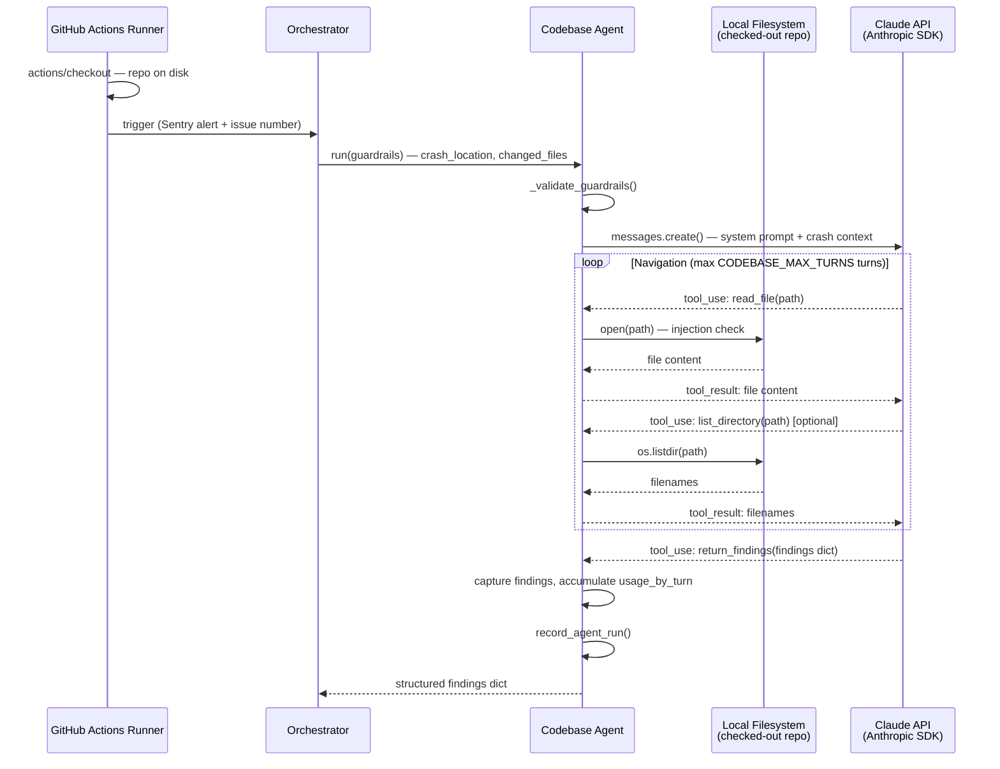

# D.5 — Codebase Agent Spec

**Status: DRAFT — awaiting sign-off**
**Architecture doc sections:** `Codebase Agent Query Contract`, `Agent Catalog`, `Principles`, `Codebase Agent Findings Schema`
**Dependency map:** `agents/specs/DEPENDENCY_MAP.md`

---

## What this slice builds

A Claude-assisted codebase navigator (`agents/codebase_agent.py`) that receives a crash location and list of changed files from the Orchestrator, then iteratively reads the filesystem to trace the root cause. Claude drives navigation — deciding what to read next — until the root cause is found or the turn budget is exhausted. Returns a structured findings dict (~50 tokens) to the Orchestrator. Zero interpretation, zero raw code snippets.

This is the first agent in the pipeline to make real Anthropic SDK calls. `usage_by_turn` is accumulated from every `client.messages.create()` call and passed to `record_agent_run`.

### Where This Agent Runs

Unlike D.1–D.4 (which call external HTTP APIs and can run anywhere), the Codebase Agent reads the local filesystem. It **must run on a GitHub Actions runner where the repository has been checked out**. File paths like `src/hooks/useMenu.ts` resolve relative to the repository root on the runner's local storage — they are physically present because of the `actions/checkout` step.

The only secret this agent requires is `ANTHROPIC_API_KEY`.

### Flow Diagram



---

## Signature

```python
# agents/codebase_agent.py
def run(guardrails: dict, issue_number: str = "") -> dict:
    ...
```

**Guardrails consumed:**

| Key | Type | Source | Notes |
|---|---|---|---|
| `crash_location` | `str` | Sentry extractor findings | File + line where error occurred, e.g. `src/components/MenuItemCard.tsx:42` |
| `changed_files` | `list[str]` | GitHub extractor findings | Files changed in the release that triggered the error |
| `max_files_to_read` | `int` | Orchestrator guardrail | Hard cap on total files Claude may read in one run |

---

## Return Shape

Matches `Codebase Agent Findings Schema` in `agent-architecture.md`.

```python
{
    "status": "completed",          # see Exit Conditions for full status set
    "source": "codebase",
    "crash_location":  "src/components/MenuItemCard.tsx:42",
    "root_cause_file": "src/hooks/useMenuItems.ts:23",
    "missing_field":   "price",                         # None if not a missing-field error
    "fix_location":    "graphql/menu.graphql — MenuItem type",
    "fix_type":        "add_field",                     # see Fix Types table below
    "fix_detail":      "Add price: Float! to MenuItem type and populate in useMenuItems hook",
    "runbook_match":   "missing-field-frontend-query",  # None if no match
    "injection_flag":  False,
    "pii_flag":        False,
}
```

**Fix Types:**

| Value | Meaning |
|---|---|
| `add_field` | A field is missing from a type, query, or schema |
| `remove_field` | A field was removed but is still referenced |
| `wrong_value` | A field exists but has an incorrect value or type |
| `missing_import` | A symbol is used but not imported |
| `logic_error` | Incorrect conditional, null check, or computation |
| `config_error` | A config value is missing or misconfigured |

Error statuses return a minimal dict:

```python
{"status": "<status>", "source": "codebase"}
```

---

## Implementation Rules

1. Import `CODEBASE_MODEL`, `CODEBASE_MAX_TURNS`, `CODEBASE_MAX_TOKENS` from `agents/config.py` — never hardcode.
2. Import `STATUS_COMPLETED`, `STATUS_NO_DATA`, `STATUS_INJECTION_DETECTED`, `STATUS_INVALID_INPUT`, `STATUS_PARTIAL` from `agents/config.py`. Add `STATUS_PARTIAL = "partial"` to `config.py` — it does not exist yet.
3. Import `_INJECTION_RE` from `agents/patterns.py` — used in `_read_file` to guard file content before returning it to Claude.
4. Import `record_agent_run` from `agents/sentry_utils.py` — call before every `return` in `run()`.
5. Import `build_system_prompt` from `agents/prompt_utils.py` — wrap the system prompt for prompt caching.
6. Use `anthropic.Anthropic()` client — do not instantiate inside the loop; create once before the loop.
7. Accumulate `usage_by_turn` after every `client.messages.create()` call — this agent makes real Claude API calls, unlike D.1–D.4.
8. The agentic loop is bounded by `CODEBASE_MAX_TURNS` — never use `while True`.
9. Claude returns findings via a `return_findings` tool call — do not parse free text. Capture the tool args dict as the result.
10. `_read_file` and `_list_directory` are the only filesystem access points — scope enforcement lives in these functions, not in the prompt.
11. No cross-feature imports — shared helpers come only from `patterns.py`, `sentry_utils.py`, `config.py`, `prompt_utils.py`.

---

## Filtering Pipeline

1. **Validate guardrails** — `crash_location` must be a non-empty string; `max_files_to_read` must be a positive int. Return `invalid_input` immediately on failure — no Claude call made.
2. **Validate crash_location is in scope** — path must start with one of the allowed prefixes (`src/`, `graphql-gateway/`, `backend/`, `docs/`). Return `no_data` if outside scope.
3. **Build system prompt** — wrap with `build_system_prompt()` for prompt caching. System prompt instructs Claude: navigate read-only, call `return_findings` when done, never return raw code.
4. **Build initial user message** — pass `crash_location`, `changed_files`, and `max_files_to_read` as structured input.
5. **Agentic loop** — each turn: call `client.messages.create()`, append usage to `usage_by_turn`. On `stop_reason == "tool_use"`: dispatch to `_process_tool_call()`. On `stop_reason == "end_turn"` or `return_findings` tool called: exit loop.
6. **Injection guard in tool functions** — `_read_file` checks file content against `_INJECTION_RE` before returning it to Claude. On match: return injection error string to Claude and set `injection_flag = True`; `run()` returns `injection_detected` on next turn.
7. **Turn budget exhausted** — if loop exits without `return_findings` being called, return `status: partial` with whatever partial fields were extracted.

---

## Exit Conditions

| Status | Trigger | Orchestrator action |
|---|---|---|
| `completed` | Claude called `return_findings` with all required fields within turn budget | Pass to Recommendation Agent |
| `partial` | Turn budget (`CODEBASE_MAX_TURNS`) exhausted before `return_findings` called | Pass partial findings to Recommendation Agent with confidence penalty |
| `no_data` | `crash_location` not found in filesystem scope | Skip codebase findings in payload |
| `injection_detected` | `_INJECTION_RE` matched in file content during navigation | Flag on GitHub Issue; stop processing |
| `invalid_input` | Guardrails dict has wrong types or missing required fields | Log misconfiguration; skip codebase findings |

---

## Private Helper Functions

```python
def _validate_guardrails(guardrails: dict) -> str | None:
    # returns error string if crash_location missing/empty or max_files_to_read is not a positive int; None if valid

def _is_path_allowed(path: str) -> bool:
    # returns True if path starts with src/, graphql-gateway/, backend/, or docs/

def _read_file(path: str) -> str:
    # scope check via _is_path_allowed; injection check via _INJECTION_RE; returns file content or error string

def _list_directory(path: str) -> list[str]:
    # scope check via _is_path_allowed; returns sorted filenames or error string

def _build_tool_definitions() -> list[dict]:
    # returns Anthropic-format tool schemas for read_file, list_directory, and return_findings

def _process_tool_call(tool_name: str, tool_input: dict, files_read: list[str], max_files: int) -> tuple[str, bool]:
    # dispatches tool_name to the correct Python function; enforces max_files cap;
    # returns (result_string, injection_detected_flag)
```

---

## TDD Test Plan

File: `agents/tests/test_codebase_agent.py`

| # | Test name | What it verifies |
|---|---|---|
| 1 | `test_returns_completed_when_claude_calls_return_findings` | Claude calls `return_findings` tool → `status="completed"`, `source="codebase"`, all findings fields present |
| 2 | `test_returns_partial_when_turn_budget_exhausted` | Mock SDK returns `tool_use` for all turns without calling `return_findings` → `status="partial"` |
| 3 | `test_returns_no_data_when_crash_location_out_of_scope` | `crash_location="etc/passwd"` → `status="no_data"`, no Claude call made |
| 4 | `test_returns_invalid_input_when_crash_location_missing` | `guardrails={}` → `status="invalid_input"`, no Claude call made |
| 5 | `test_returns_invalid_input_when_max_files_not_int` | `guardrails={"crash_location": "src/x.ts:1", "max_files_to_read": "ten"}` → `status="invalid_input"` |
| 6 | `test_injection_in_file_content_returns_injection_detected` | `_read_file` returns injection pattern → `status="injection_detected"`, `injection_flag=True` |
| 7 | `test_read_file_blocked_outside_scope` | `_read_file("agents/config.py")` → returns error string, file not read |
| 8 | `test_list_directory_blocked_outside_scope` | `_list_directory(".env")` → returns error string |
| 9 | `test_max_files_cap_enforced` | Mock reads 3 files; `max_files_to_read=2` → third `read_file` call returns cap error string |
| 10 | `test_usage_by_turn_accumulated` | Mock two SDK turns → `record_agent_run` called with `usage_by_turn` list of length 2 |
| 11 | `test_record_agent_run_called_on_every_return` | Mock `record_agent_run` — assert called for `completed`, `partial`, `invalid_input`, `no_data` paths |
| 12 | `test_build_system_prompt_used` | Assert `build_system_prompt` called — confirms caching wrapper is applied |
| 13 | `test_changed_files_included_in_initial_message` | Assert `changed_files` from guardrails appears in the first user message content |

All Claude SDK calls mocked with `unittest.mock.patch`. No real Anthropic API calls in tests.

---

## Files Touched

| File | Change |
|---|---|
| `agents/codebase_agent.py` | New — implementation |
| `agents/tests/test_codebase_agent.py` | New — 13 TDD tests |
| `agents/config.py` | Add `STATUS_PARTIAL = "partial"` |
| `agents/specs/DEPENDENCY_MAP.md` | Update — add `codebase_agent` row and tool definitions |

---

## Acceptance Criteria

- [ ] All 13 tests green
- [ ] Full test suite green (no regressions — currently 76 tests)
- [ ] No real Anthropic API calls in tests (all mocked)
- [ ] `record_agent_run` called on every return path
- [ ] `build_system_prompt` called — caching wrapper always applied
- [ ] `usage_by_turn` accumulated from every SDK call and passed to `record_agent_run`
- [ ] Filesystem scope enforced in tool functions, not in the prompt
- [ ] No hardcoded values — all config from `agents/config.py`
- [ ] No cross-feature imports
