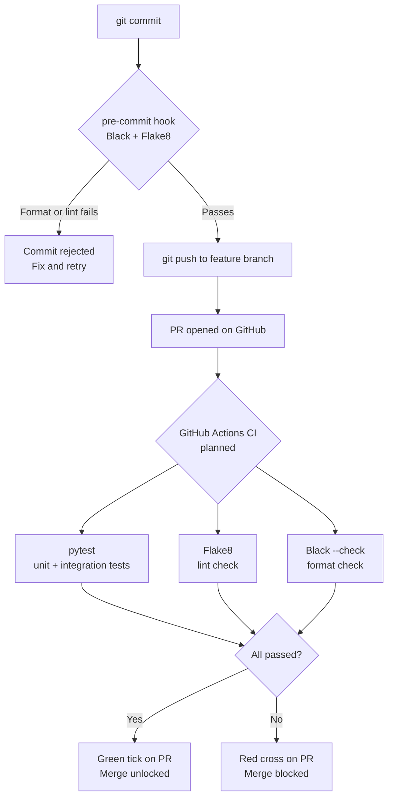

# Engineering Practices — Backend

**Scope:** Backend engineers working in `backend/` (Python / FastAPI).
**Last updated:** 2026-04-24

---

## Documents

| Document | What it covers |
|---|---|
| [pre-commit-hooks.md](pre-commit-hooks.md) | pre-commit framework — Black and Flake8, what runs on every commit, setup for new engineers |
| [ci-pipeline.md](ci-pipeline.md) | GitHub Actions CI workflow for the backend — pytest, linting, what is planned |

---

## Related Shared Practices

| Document | Location |
|---|---|
| Branching strategy | [`docs/engineering-practices/branching-strategy.md`](../../../docs/engineering-practices/branching-strategy.md) |
| Full AI agent workflow | [`docs/engineering-practices/ai-agent-workflow.md`](../../../docs/engineering-practices/ai-agent-workflow.md) |

---

## Backend Guardrail Summary

