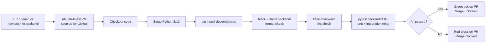

# CI Pipeline — Backend

**Scope:** Backend engineers working in `backend/` (Python / FastAPI).
**Last updated:** 2026-04-24
**Status:** Backend CI pipeline is planned. Canary tests run on a schedule (`canary.yml`) but a PR-gating CI workflow does not yet exist for the backend.

---

## Current State vs Target State

| Check | Current | Target |
|---|---|---|
| Format check (Black) | Pre-commit only | Pre-commit + CI |
| Lint check (Flake8) | Pre-commit only | Pre-commit + CI |
| Unit tests (pytest) | Manual only | CI on every PR |
| Integration tests (pytest) | Manual only | CI on every PR |
| Canary tests (live endpoints) | Scheduled every 50 min | Unchanged — scheduled |

---

## Target CI Workflow

When the backend CI pipeline is built, it will run on every PR that changes `backend/`:



| Step | Command | What it catches |
|---|---|---|
| Format check | `black --check backend/` | Code not formatted by Black — fails without rewriting |
| Lint | `flake8 backend/` | Style violations, undefined names, unused imports |
| Tests | `pytest backend/tests/ -v` | Unit and integration test regressions |

---

## Why `black --check` Not `black` in CI

In CI we use `black --check` (read-only) rather than `black` (rewrite). CI should report failures, not silently reformat code. If the format check fails it means the developer did not run Black locally — the correct fix is to reformat locally, commit, and push again.

---

## Difference from Pre-Commit

| | Pre-commit (Black + Flake8) | CI (Black --check + Flake8 + pytest) |
|---|---|---|
| Scope | Staged files only | Whole `backend/` directory |
| Tests | Not run | Full pytest suite |
| Skippable | Yes | No |
| Visible to team | No | Yes — on the PR |

Pre-commit gives fast local feedback. CI gives authoritative enforcement that cannot be bypassed.

---

## Canary Tests — Always Running (Separate from PR CI)

The canary workflow (`.github/workflows/canary.yml`) runs independently on a schedule every 50 minutes. It hits the live production API endpoints. This is not PR-gating CI — it monitors production health continuously.

| Workflow | Trigger | Purpose |
|---|---|---|
| `ci.yml` *(planned)* | Every PR push | Gate: block merging broken code |
| `canary.yml` | Every 50 minutes | Monitor: alert on production failures |

---

## How to Investigate a Failure (Once CI Is in Place)

1. Open the PR on GitHub
2. Click the red **✗** next to the failing check → **Details**
3. Expand the failing step in the Actions tab
4. Read the error — pytest output includes the test name, file, line, and assertion failure
5. Fix locally, run `pytest backend/tests/` to verify, push the fix

**Common failures:**

| Failure | Likely cause | Where to look |
|---|---|---|
| `black --check` fails | File not formatted | Run `black backend/` locally, re-stage, commit |
| `flake8` fails | Lint violation | Read the output — shows file, line, rule code |
| `pytest` fails | Test regression | Read the assertion failure — compare expected vs actual |
| `pip install` fails | Dependency version conflict | Check `requirements.txt` for conflicting pins |

---

## Path Filtering — Only Trigger on Backend Changes

The backend CI workflow should only trigger when backend files change. A frontend-only PR should not run backend tests.

```yaml
on:
  push:
    paths:
      - 'backend/**'
      - '.pre-commit-config.yaml'
  pull_request:
    paths:
      - 'backend/**'
      - '.pre-commit-config.yaml'
```

This keeps backend CI and frontend CI independent — each runs only when its own code changes, and neither consumes runner minutes unnecessarily.
