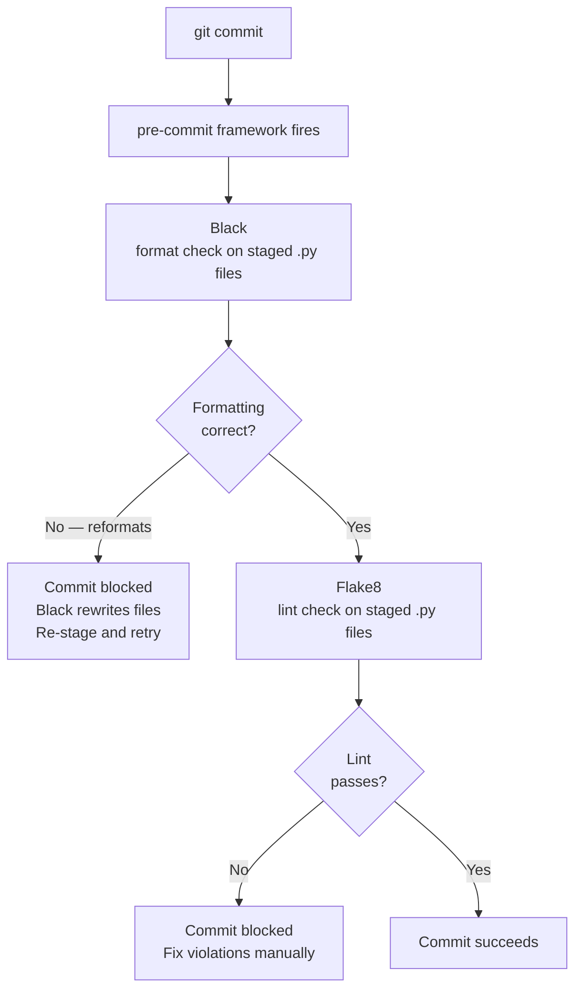

# Pre-Commit Hooks — Backend

**Scope:** Backend engineers working in `backend/` (Python / FastAPI).
**Last updated:** 2026-04-24
**Tool:** pre-commit framework (`.pre-commit-config.yaml` at the repo root)

---

## What Happens on Every Commit



---

## What Is Checked

| Tool | What it does | Auto-fixes? |
|---|---|---|
| Black | Enforces consistent Python code formatting (line length 88) | No — rewrites files; you re-stage and commit |
| Flake8 | Python linting — style errors, undefined names, unused imports | No — you fix manually |

**Flake8 config** (in `.pre-commit-config.yaml`):
- `--extend-ignore=E203,E501` — ignores whitespace-before-colon (conflicts with Black) and line-too-long (Black handles length)

---

## Setup for New Engineers

After cloning the repository:

```bash
pip install pre-commit
pre-commit install
```

**Verify the hook is installed:**
```bash
cat .git/hooks/pre-commit
# Should reference pre-commit framework
```

Unlike Husky (which installs automatically via `npm install`), the pre-commit framework requires a manual install step. New engineers must run `pre-commit install` or commits will not be checked.

> **Tip:** Add `pre-commit install` to your onboarding checklist. If it is not run, local commits bypass all backend checks silently.

---

## Why Black Blocks Instead of Auto-Fixing

Black rewrites Python files to enforce its formatting. When Black reformats a staged file, the staged version and the on-disk version diverge — the commit would include unformatted code. So pre-commit blocks the commit, Black rewrites the file on disk, and you must re-stage and retry.

**Workflow after Black rejects a commit:**
```bash
# Black has already rewritten the files
git add backend/path/to/changed_file.py   # re-stage the reformatted file
git commit -m "your message"              # retry — Black will pass this time
```

---

## Pre-commit vs CI — The Difference

| | Pre-commit | CI (planned) |
|---|---|---|
| Scope | Staged files only | Whole `backend/` directory |
| Speed | Fast — seconds | Slower — minutes |
| Skippable | Yes — `git commit --no-verify` | No |
| Runs tests | No | Yes — pytest |
| Visible to team | No | Yes — on the PR |

Pre-commit gives fast local feedback on format and lint. CI gives authoritative enforcement including the full test suite.

---

## Bypassing the Hook (Discouraged)

```bash
git commit --no-verify -m "message"
```

Skips pre-commit entirely. Acceptable only when the hook itself is broken. CI will still run Black and Flake8 checks — bypassing pre-commit does not bypass CI.

---

## Common Issues

| Issue | Cause | Fix |
|---|---|---|
| `pre-commit: command not found` | pre-commit not installed | `pip install pre-commit` |
| Hook fires but nothing runs | No `.py` files staged | Expected — only Python files are checked |
| Black rewrites a file | Code is not Black-formatted | Re-stage the file and commit again |
| Flake8 reports `E302` (expected 2 blank lines) | Missing blank lines between top-level definitions | Add the blank lines |
| Flake8 reports `F401` (imported but unused) | Import no longer needed | Remove the import |
