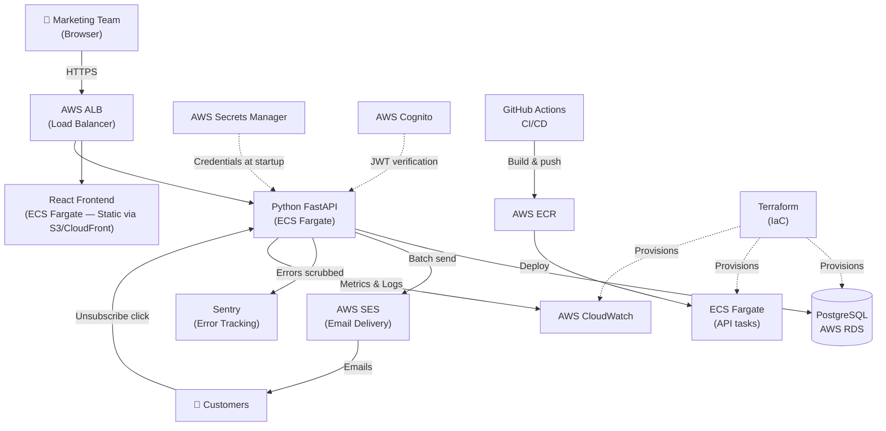
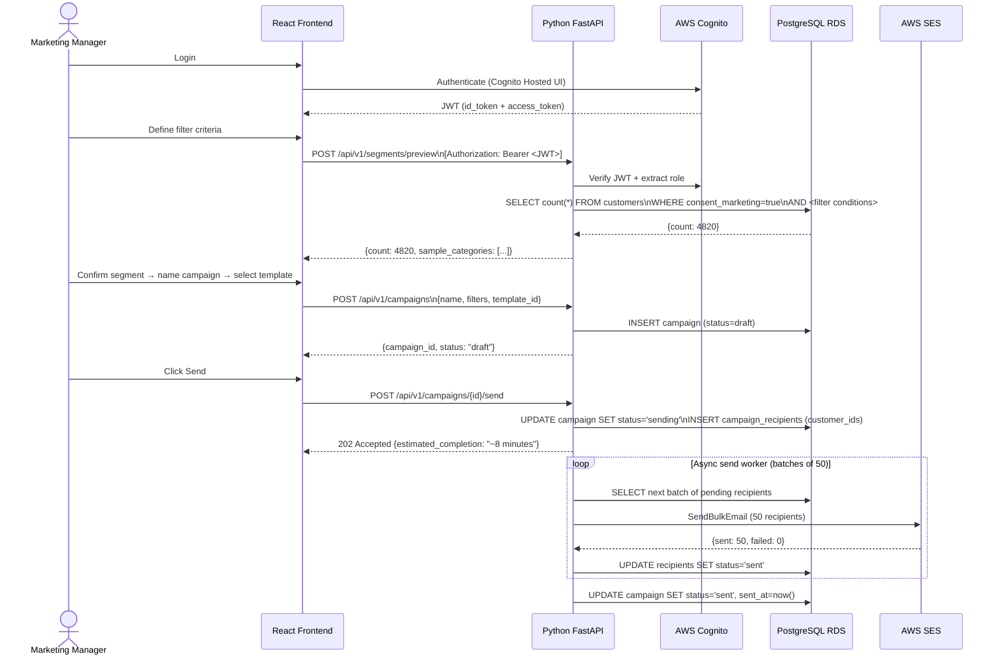

> **TEST DOCUMENT** — Generated by the `design-plan` skill for testing purposes only. Not a real project design document. Do not use as a basis for implementation.

# Targeted Marketing Platform — Design Document

**Status:** Draft
**Feature:** targeted-marketing
**Last updated:** 2026-05-11

---

## Table of Contents

| Section | Description |
|---|---|
| [Problem Statement & Goals](#problem-statement--goals) | Goals, Non-Goals, Success Metrics |
| [User Personas & Journeys](#user-personas--journeys) | Primary actor, happy path, edge cases |
| [Assumptions & Constraints](#assumptions--constraints) | Technical, financial, time-based |
| [Dependencies](#dependencies) | Upstream and downstream |
| [Compliance, Security, & Privacy](#compliance-security--privacy) | AuthN/AuthZ, PII, GDPR |
| [Proposed Architecture](#proposed-architecture) | Mermaid diagrams, component narrative |
| [Alternative Solutions](#alternative-solutions) | Trade-offs table, rejection reasons |
| [Technology Stack & Infrastructure](#technology-stack--infrastructure) | Choices with rationale |
| [Data Model & Schema](#data-model--schema) | Entities, relationships, state machines |
| [Observability & Operational Health](#observability--operational-health) | SLOs, logging, alerting |
| [Scalability & Performance](#scalability--performance) | Load assumptions, bottlenecks |
| [Testing & QA Strategy](#testing--qa-strategy) | Unit, integration, E2E, load |
| [Deployment & Release Plan](#deployment--release-plan) | CI/CD, rollback strategy |
| [Risks & Mitigations](#risks--mitigations) | Top risks with contingencies |
| [Open Questions](#open-questions) | Unresolved decisions |

---

## Problem Statement & Goals

### Problem

The marketing team has no structured way to identify and reach specific customer segments based on their behaviour and purchase history. Currently, campaigns are either sent to all customers (low relevance, high unsubscribe risk) or require manual data exports and spreadsheet filtering (slow, error-prone, and not repeatable). This means high-value customers who are likely to respond to a specific offer are missed, and low-relevance customers receive noise they did not ask for.

### Goals

- Enable the marketing team to define filter criteria based on customer purchase history and usage patterns, and preview the matching customer count before committing to a campaign.
- Allow the marketing team to create, manage, and send targeted email campaigns directly from a web UI without engineering involvement.
- Track campaign delivery status (sent, bounced, failed) per recipient.
- Ensure all outreach is consent-gated — no customer receives marketing email without explicit opt-in recorded in the system.

### Non-Goals

- **No real-time recommendation engine.** Product recommendations are curated by the marketing team, not generated by an ML model. This system is a targeting and delivery tool, not an AI recommender.
- **No customer-facing UI changes.** This is an internal marketing tool only. Customers interact with it only by receiving emails.
- **No A/B testing framework.** Split testing of templates or offers is out of scope for v1.
- **No cross-channel outreach.** SMS, push notifications, and in-app messages are out of scope. Email only.
- **No customer data collection.** This system reads existing customer and event data — it does not add new tracking or analytics instrumentation.
- **No payment or transaction processing.** Offers are communicated via email; redemption happens in the existing product flow.

### Success Metrics

| Metric | Target |
|---|---|
| Filter preview response time | p95 < 2 seconds |
| Campaign creation to first email sent | < 5 minutes end-to-end |
| API error rate | < 0.5% sustained |
| SES bounce rate | < 2% per campaign (AWS hard limit is 5% before suspension) |
| Zero PII in logs or error tracking events | Verified in CI via Sentry `beforeSend` test |
| Marketing team can create and send a campaign independently | No engineering ticket required |

---

## User Personas & Journeys

### Primary Persona — Marketing Manager

**Role:** Internal marketing team member responsible for customer engagement campaigns.
**Goal:** Identify customers likely to be interested in a specific offer and send them a targeted email without waiting for engineering.
**Context:** Non-technical. Comfortable with filter-like UIs (similar to spreadsheet filters or CRM query builders). Has no SQL access.

### Happy Path — Create and Send a Campaign

1. Marketing Manager logs in to the Campaign Builder UI.
2. Navigates to **New Campaign**.
3. Defines filter criteria — e.g. "customers who purchased Category X in the last 90 days AND have not received a campaign in the last 30 days".
4. Clicks **Preview** — sees the matching customer count and a sample (aggregate only, no individual PII shown in UI).
5. If count is acceptable, names the campaign and selects an email template.
6. Reviews the campaign summary and clicks **Send**.
7. The system queues the send. Marketing Manager sees a confirmation with estimated completion time.
8. From the Campaign List, they can monitor delivery status: sent, bounced, failed counts.

### Edge Cases the Architecture Must Handle

**Empty segment:** Filter criteria return zero customers. The system must prevent the campaign from being created with zero recipients — show an error at preview stage, not after send is triggered.

**Large segment (>50,000 recipients):** Email sending is async — the API must return immediately after accepting the send request, not after all emails are sent. The UI must show a "sending in progress" state, not a spinner that times out.

**Consent not recorded:** A customer in the DB has no explicit `consent_marketing` flag. The system must exclude them by default — opt-in must be explicit, not assumed.

---

## Assumptions & Constraints

### Technical

- Customer and purchase/event data already exists in a PostgreSQL database accessible to the API.
- A `consent_marketing` boolean field exists (or will be added as an additive migration) on the customer record. Customers without explicit `true` are excluded from all campaigns.
- The email sending volume will not exceed AWS SES account limits (default: 50,000/day, 14/second). If a campaign requires more, a sending rate limit will be enforced in the async worker.
- All environments (dev, staging, prod) run on AWS. No on-premise components.
- Existing customer data schema is stable — this system reads from it but does not modify the core customer tables.

### Financial

- AWS infrastructure budget: target < $300/month at baseline load (see Scalability section for estimates).
- AWS SES pricing: $0.10 per 1,000 emails — variable cost. A 50,000-recipient campaign costs $5. Budget cap enforced at the campaign recipient limit (100,000 per send).
- No external SaaS marketing platform licensing — the entire stack is custom-built on AWS to avoid $800–2,000/month SaaS costs.

### Time-Based

- No hard deadline specified. However, the design should allow Phase A (foundation) to be deployable independently so AWS infrastructure and auth can be validated before the application layers are built.

---

## Dependencies

### Upstream (must exist before we can build)

| Dependency | Status | Risk if unavailable |
|---|---|---|
| Existing PostgreSQL DB with customer + event data | Available today | Blocks all development |
| AWS account with SES domain verification for sending domain | Needs SES domain setup | Blocks email sending (Phase D) |
| Customer `consent_marketing` field in customer table | Needs additive migration | Blocks any campaign send |
| AWS IAM roles for ECS task execution | Needs Terraform provisioning | Blocks deployment |

### Downstream (will depend on this system)

| Dependent | Nature of dependency |
|---|---|
| Email unsubscribe flow | When a customer unsubscribes via email link, the system must update `consent_marketing = false` in the DB |
| Future A/B testing (post-v1) | Campaign and recipient tables will need a `variant` column added when A/B testing is introduced |

---

## Compliance, Security, & Privacy

### Compliance Regime

**GDPR applies.** Customer data includes names, email addresses, and purchase history — all are personal data under GDPR Article 4. Key constraints:

- Marketing emails require explicit opt-in consent (Recital 32). The `consent_marketing` flag is the record of that consent. It must be enforced server-side — the API enforces this on every segment query, unconditionally.
- Customers must be able to opt out. Every marketing email must include an unsubscribe link. Clicking it calls the API to set `consent_marketing = false`. This must be processed immediately.
- Data minimisation: the UI shows aggregate counts only in segment preview — not individual customer names or emails. Individual PII is never exposed in the campaign builder UI.

### Authentication & Authorisation

- **AuthN:** AWS Cognito user pool for the marketing team. JWT tokens issued by Cognito, verified by FastAPI middleware on every request. No anonymous access.
- **AuthZ:** Two roles enforced server-side:
  - `marketing_viewer` — can view campaigns and preview segments, cannot send.
  - `marketing_sender` — can create and send campaigns.
- Role membership is managed in Cognito user groups. The API reads the `cognito:groups` claim from the JWT — it is never trusted from the request body.
- UI role gating is a convenience only — all enforcement is server-side.

### PII and Sensitive Data Handling

- Customer names, email addresses, phone numbers, and purchase history are PII.
- **Never logged at any level** — not in application logs, not in error events.
- Sentry `beforeSend` hook scrubs: `customer_email`, `customer_name`, `customer_id`, `email`, `recipient_email` from all outgoing Sentry events.
- The segment preview API returns `{ count: N, sample_categories: [...] }` — no customer identifiers in the response.
- Campaign recipient records in the DB store `customer_id` (foreign key) only — not email address. Email address is resolved at send time from the customer table and passed directly to SES. It is never written to the `campaign_recipients` table.

### Secrets Management

- All secrets (DB credentials, SES SMTP, Cognito client secret) stored in AWS Secrets Manager.
- ECS task role has IAM permission to read specific secret ARNs — not wildcard access.
- No secrets in environment variables in plaintext. Secrets Manager injects at task startup.
- GitHub Actions uses OIDC federation to assume an IAM deploy role — no long-lived AWS credentials in CI.

### Audit and Data Retention

- Every campaign send is recorded with: campaign ID, sender (Cognito user ID), recipient count, timestamp. Stored in the `campaigns` table.
- Consent changes (opt-in and opt-out) are recorded in a `consent_audit_log` table with timestamp and source.
- Campaign and recipient records retained for 2 years then archived (S3 Glacier). Customer consent audit log retained indefinitely (regulatory requirement).

---

## Proposed Architecture

### System Context Diagram



### Sequence Diagram — Campaign Creation Happy Path



### Component Narrative

The marketing team accesses the React frontend served via CloudFront. All API calls go through the ALB to the FastAPI service running on ECS Fargate. JWT tokens from Cognito are verified by FastAPI middleware on every request — role claims determine whether the user can preview, create, or send campaigns.

The segment preview endpoint translates the frontend's JSONB filter definition into a parameterised SQL query against the customer and event tables. It always appends `consent_marketing = true` unconditionally — this cannot be bypassed by the frontend.

Campaign sends are accepted asynchronously. The API inserts the campaign and recipients into the DB with status `pending`, returns a 202 immediately, and a background worker processes batches of 50 through SES. SES bounce and complaint events feed back to the API via SNS webhook to update recipient status.

All credentials are fetched from Secrets Manager at ECS task startup. GitHub Actions builds Docker images, pushes to ECR, and updates the ECS service definition — triggering a rolling deployment.

---

## Alternative Solutions

### Trade-offs Table

| | **Option A — Custom-built on AWS (Proposed)** | **Option B — SaaS Platform (e.g. HubSpot)** | **Option C — Event-driven streaming (Kafka)** |
|---|---|---|---|
| Complexity | Medium — standard web stack | Low — configuration-only | High — Kafka, stream processors, complex ops |
| Cost | ~$150–300/mo AWS | $800–2,000/mo SaaS licensing | ~$500–800/mo infra + engineering overhead |
| Time to build | 8–12 weeks | 2–4 weeks | 18–26 weeks |
| Custom filter logic | Full control — any SQL predicate | Limited to platform-defined fields | Full control |
| Scalability | Horizontal ECS scaling | Vendor-managed | Designed for millions of events/sec |
| Key risk | Full build responsibility | Vendor lock-in; cannot filter on custom event schema | Massively over-engineered for batch marketing |

### Option B — SaaS Marketing Platform (Rejected)

Platforms like HubSpot or Klaviyo offer campaign management out of the box. The rejection reason is not cost alone — the specific constraint is **custom filter logic**. The filtering requirements (purchase category + recency + campaign frequency) require access to the internal event schema. SaaS platforms cannot query our `customer_events` table directly; they require data exports or API sync, which introduces lag, a new integration surface, and means filter criteria are limited to what the platform natively supports. When the marketing team asks "customers who bought X but not Y in the last 60 days and haven't been emailed in 30 days", a SaaS platform cannot answer that without custom ETL work that costs as much as building the tool.

### Option C — Event-Driven Streaming (Rejected)

A Kafka-based streaming architecture would allow real-time segment membership updates as customers generate events. This is appropriate when segments change continuously and campaigns must be triggered within seconds of a customer action. Our use case is **batch marketing** — campaigns are planned and sent on a schedule, not triggered by real-time events. The complexity of operating Kafka (cluster management, consumer group rebalancing, offset management, schema registry) is not justified when a scheduled SQL query achieves the same result at a fraction of the operational cost.

---

## Technology Stack & Infrastructure

| Technology | Why it fits this problem |
|---|---|
| **React + TypeScript** | The filter builder UI is a multi-step form with complex conditional state (add/remove filter conditions, preview updates). TypeScript's type system ensures filter criteria objects passed to the API match the expected JSONB schema at compile time, catching mismatches before they reach the DB. |
| **Python + FastAPI** | Async request handling allows the campaign send endpoint to accept large workloads and return 202 without blocking. Pydantic models validate and serialise the JSONB filter schema at the API boundary. The team has existing Python expertise across the backend. |
| **PostgreSQL (AWS RDS)** | Customer and event data is relational — campaign → recipient relationships map naturally to foreign keys. JSONB columns store filter definitions without requiring schema migrations every time a new filter dimension is added. Read replicas handle segment preview queries without impacting transactional workloads. RDS manages backups, failover, and patching. |
| **AWS SES** | Native AWS service — no additional vendor contract. At $0.10/1,000 emails it is the lowest-cost option available. Bounce and complaint feedback loops integrate directly with SNS/CloudWatch, keeping the observability stack consolidated in AWS. |
| **AWS ECS Fargate** | Serverless containers eliminate EC2 fleet management. Scales to zero when the marketing team is not active (cost efficiency). Native integration with ECR, ALB, CloudWatch, and Secrets Manager reduces glue code. |
| **AWS CloudWatch** | Already included in the AWS bill. Centralises metrics from ECS, RDS, ALB, and SES in one place. No additional agent or third-party APM contract needed for infrastructure-level observability. |
| **AWS Cognito** | Managed identity provider — handles JWT issuance, token refresh, MFA, and user management without building a custom auth system. The marketing team is internal and small; a Cognito user pool is sufficient without the complexity of a full SSO federation for v1. |
| **Terraform** | IaC for all AWS resources ensures dev/staging/prod parity. State stored in S3 with DynamoDB lock table — safe for team use. Enables environment tear-down and rebuild for cost management. |
| **Sentry** | Already in use across the stack. Error tracking with `beforeSend` PII scrubbing is an established pattern. No new vendor onboarding. |

---

## Data Model & Schema

### Entities

#### `customers` (existing — read-only, additive migration only)

| Column | Type | Notes |
|---|---|---|
| `id` | UUID | Primary key |
| `email` | VARCHAR | PII — never logged |
| `name` | VARCHAR | PII — never logged |
| `consent_marketing` | BOOLEAN | **New column (additive migration).** Default FALSE. NULL treated as FALSE. |
| `consent_updated_at` | TIMESTAMPTZ | **New column.** When consent was last changed. |
| `created_at` | TIMESTAMPTZ | Existing |

#### `customer_events` (existing — read-only)

| Column | Type | Notes |
|---|---|---|
| `id` | UUID | Primary key |
| `customer_id` | UUID | FK → customers |
| `event_type` | VARCHAR | e.g. `purchase`, `page_view`, `cart_abandon` |
| `metadata` | JSONB | Event-specific fields (category, product_id, amount) |
| `occurred_at` | TIMESTAMPTZ | Indexed |

#### `email_templates` (new)

| Column | Type | Notes |
|---|---|---|
| `id` | UUID | Primary key |
| `name` | VARCHAR | Display name |
| `subject` | VARCHAR | Email subject line |
| `body_html` | TEXT | HTML email body with `{{unsubscribe_url}}` placeholder |
| `created_by` | VARCHAR | Cognito user ID |
| `created_at` | TIMESTAMPTZ | |

#### `campaigns` (new)

| Column | Type | Notes |
|---|---|---|
| `id` | UUID | Primary key |
| `name` | VARCHAR | |
| `filters` | JSONB | Serialised filter definition |
| `template_id` | UUID | FK → email_templates |
| `status` | VARCHAR | See state machine below |
| `recipient_count` | INTEGER | Set when recipients are materialised |
| `sent_count` | INTEGER | Incremented by async worker |
| `failed_count` | INTEGER | |
| `created_by` | VARCHAR | Cognito user ID |
| `created_at` | TIMESTAMPTZ | |
| `sent_at` | TIMESTAMPTZ | Set when all batches complete |

#### `campaign_recipients` (new)

| Column | Type | Notes |
|---|---|---|
| `id` | UUID | Primary key |
| `campaign_id` | UUID | FK → campaigns |
| `customer_id` | UUID | FK → customers. **Email is NOT stored here — resolved at send time.** |
| `status` | VARCHAR | pending / sent / failed / bounced |
| `sent_at` | TIMESTAMPTZ | |

#### `consent_audit_log` (new)

| Column | Type | Notes |
|---|---|---|
| `id` | UUID | Primary key |
| `customer_id` | UUID | FK → customers |
| `old_value` | BOOLEAN | Prior consent value |
| `new_value` | BOOLEAN | New consent value |
| `source` | VARCHAR | `signup`, `unsubscribe_link`, `admin` |
| `changed_at` | TIMESTAMPTZ | |

### Campaign State Machine

```
draft ──→ sending ──→ sent
  │                    │
  └──→ cancelled       └──→ partially_failed
```

- `draft`: created, recipients not yet materialised
- `sending`: send triggered, async worker processing batches
- `sent`: all recipients processed (sent + failed counts finalised)
- `partially_failed`: > 5% of recipients failed delivery
- `cancelled`: cancelled before send — only valid from `draft`

### Indexes

```sql
-- Segment preview performance
CREATE INDEX idx_customers_consent ON customers (consent_marketing) WHERE consent_marketing = true;
CREATE INDEX idx_customer_events_lookup ON customer_events (customer_id, event_type, occurred_at DESC);

-- Campaign recipient processing
CREATE INDEX idx_recipients_pending ON campaign_recipients (campaign_id, status) WHERE status = 'pending';
```

### Migration Strategy

All new columns on the `customers` table are additive with defaults. The `consent_marketing` column defaults to `FALSE` — existing customers are opted out until they explicitly opt in. Rollback migration drops the new columns only. No destructive changes to existing tables.

---

## Observability & Operational Health

### SLOs

| Signal | SLO | Alert threshold |
|---|---|---|
| Filter preview API (p95 latency) | < 2 seconds | > 3s for 5 minutes |
| Campaign send acceptance (p95 latency) | < 500ms (async — not send completion) | > 1s for 5 minutes |
| API error rate | < 0.5% | > 1% for 5 minutes |
| SES bounce rate per campaign | < 2% | > 2% on any campaign |
| ECS task CPU | < 70% sustained | > 80% for 10 minutes |
| RDS connection count | < 80% of max_connections | > 80% for 5 minutes |

### Logging Strategy

- **Log level:** INFO in production. DEBUG only in dev/staging.
- **What is logged:** request method + path + status code + latency (no query params that may contain PII), campaign ID on state transitions, async worker batch completion (count only).
- **What is never logged:** customer email, customer name, customer ID, email body content, filter results containing customer data.
- **Destination:** CloudWatch Logs via ECS task log driver. Retention: 90 days in CloudWatch, then S3 archival.

### Error Tracking (Sentry)

- `beforeSend` hook scrubs: `customer_email`, `customer_name`, `customer_id`, `email`, `recipient_email`, `name` from all event payloads before transmission.
- Sentry `environment` tag set to `production` / `staging` — no production errors mixed with test runs.
- Alert: any new Sentry issue in production → Slack notification to engineering channel.

### Alerting

| Alert | Threshold | Notification |
|---|---|---|
| API error rate spike | > 1% for 5 min | SNS → engineering Slack |
| SES bounce rate | > 2% on any campaign | SNS → engineering + marketing Slack |
| ECS task count drops to 0 | Immediate | SNS → engineering Slack + email |
| RDS connection saturation | > 80% | SNS → engineering Slack |
| Campaign send stalled | Worker not progressing for > 30 min | CloudWatch alarm on `sent_count` delta |

### On-Call Dashboard (CloudWatch)

First thing an on-call engineer checks:
1. ECS task health (running task count, CPU/memory)
2. API 5xx rate (ALB metrics)
3. RDS connections and query latency
4. SES bounce/complaint rate
5. Async worker progress (campaign `sending` → `sent` transition rate)

---

## Scalability & Performance

### Baseline Load

- **Marketing users:** 10 concurrent maximum (small internal team)
- **Customer records:** 50,000 customers
- **Customer events:** ~2M rows (average 40 events per customer)
- **Campaigns per day:** 5–10, each up to 50,000 recipients
- **Peak SES rate:** 14 emails/second (AWS default quota) → 50,000 recipients in ~60 minutes

### Growth Assumptions

- 2× customer growth (100k) within 12 months — handled by existing RDS index strategy
- 10× growth (500k) within 3 years — requires read replica for segment preview queries and potential RDS instance tier upgrade (db.t3.medium → db.r6g.large)

### Bottlenecks and Mitigations

| Bottleneck | Mitigation |
|---|---|
| Segment preview query on large event table | Composite index on `(customer_id, event_type, occurred_at)`. Read replica for preview queries to avoid impacting transactional load. |
| Async worker throughput vs SES rate limit | Worker enforces 14 emails/second via token bucket rate limiter. Campaigns > 100k recipients split into daily batches. |
| DB connection pool saturation under load | PgBouncer sidecar on ECS task pool. Max pool size: 20 connections per task, 3 tasks max = 60 connections < RDS db.t3.medium limit of 170. |
| ECS cold start on first request after scale-down | Minimum task count: 1 (never scales to zero in production) |

---

## Testing & QA Strategy

### Unit Tests (pytest — no DB, no AWS)

- Filter engine: JSONB filter definition → SQL WHERE clause generation. Test all supported filter types (event_type, recency, count threshold, category).
- Campaign state machine: valid and invalid transitions.
- Sentry `beforeSend` hook: confirm PII fields are scrubbed from a synthetic event payload.
- Email template rendering: `{{unsubscribe_url}}` placeholder substitution.

### Integration Tests (pytest — real test DB, no AWS)

- Segment preview endpoint: consent enforcement (customers with `consent_marketing=false` excluded even if filter matches), empty segment returns 400 not 500, large segment returns within 2s (tested with 50k seed rows).
- Campaign CRUD: state machine enforcement (cannot send from `cancelled` status).
- Unsubscribe endpoint: sets `consent_marketing=false` and inserts `consent_audit_log` row.

**Rule:** Never mock the database in integration tests.

### End-to-End Tests (Playwright — staging environment)

- Happy path: login → define filter → preview → create campaign → send → verify `sent` status.
- Consent enforcement: verify a customer with `consent_marketing=false` does not appear in any segment preview count.
- Unsubscribe flow: click unsubscribe link in test email → verify consent updated in DB.

### Load Tests (k6 — staging environment)

- 50 concurrent users each running filter preview with a moderately complex filter → assert p95 < 2s.
- Single 50,000-recipient campaign send → assert worker completes within 70 minutes (accounting for SES rate limit).

### Acceptance Criteria (release gate)

All of the following must be green before a production release is approved:
- [ ] All unit tests pass
- [ ] All integration tests pass against a migrated test DB
- [ ] E2E happy path and consent enforcement tests pass on staging
- [ ] Load test p95 filter preview < 2s
- [ ] Sentry `beforeSend` PII scrub test passes

---

## Deployment & Release Plan

### CI/CD Pipeline (GitHub Actions)

```
push to feature branch → unit tests → lint (ruff, eslint)
PR merged to main → integration tests → build Docker image → push to ECR → deploy to staging
manual approval → deploy to production (rolling update via ECS service update)
```

GitHub Actions uses OIDC to assume an IAM deploy role — no long-lived AWS credentials stored in CI.

### Release Approach

- **v1:** Full release to production after staging validation. No feature flags for core functionality — the system is internal and the marketing team is the only user group.
- **New filter dimensions** added post-v1: behind environment variable feature flags (`FILTER_FEATURE_PURCHASE_FREQUENCY_ENABLED=true`) — allows staging validation before marketing team sees the new filter option.

### Monitoring Gates (must be green before marking stable)

- API error rate < 0.5% for 30 minutes post-deploy
- ECS task count stable (no crash loops)
- At least one successful segment preview query logged post-deploy

### Rollback Plan

| Scenario | Rollback action |
|---|---|
| API regression detected | ECS service update to previous task definition revision (< 2 minutes) |
| DB migration causes issues | Migration is additive (new columns with defaults) — rollback migration drops new columns only. No data loss. |
| SES bounce spike after campaign send | Pause campaign sends via `CAMPAIGN_SEND_ENABLED=false` environment variable (ECS redeploy takes < 2 minutes) |

**Rollback trigger criteria:** API error rate > 2% sustained for 3 minutes post-deploy, or any ECS task crash loop (3 restarts in 5 minutes).

**Blast radius of a bad deploy:** Limited to the marketing tool only. The customer-facing product (restaurant ordering, reservations) runs on a separate service and is not affected.

---

## Risks & Mitigations

| Risk | Likelihood | Impact | Mitigation | Contingency |
|---|---|---|---|---|
| **GDPR violation — marketing email sent to customer without consent** | Low (if consent check is enforced server-side) | High — regulatory fine, reputational damage | API always appends `consent_marketing = true` to every segment query. This cannot be bypassed by the frontend. Verified in integration tests. | Legal review before launch. Data protection officer sign-off on consent enforcement implementation. |
| **SES account suspended due to high bounce rate** | Medium — if customer email list has stale addresses | High — all email sending halted | Bounce rate CloudWatch alarm at 2% (well below AWS's 5% suspension threshold). Suppression list maintained in SES. | Fallback SMTP credentials for SendGrid pre-configured in Secrets Manager. API can switch provider via env var. |
| **Segment preview query timeout at scale** | Medium — as event table grows past 5M rows | Medium — marketing team blocked, not customer-facing | Composite indexes in place from day one. Read replica isolates preview queries from transactional load. | Pre-computed segment counts via nightly scheduled job as fallback. |
| **PII leaking into Sentry error events** | Low — `beforeSend` hook implemented and tested | High — GDPR violation, Sentry data residency concerns | `beforeSend` hook scrubs all known PII field names. Tested in CI with a synthetic event payload containing PII — test fails if any PII reaches the mock Sentry client. | Sentry data scrubbing rules configured as a second layer in the Sentry project settings. |
| **AWS cost overrun from unexpectedly large campaigns** | Low — campaign recipient cap enforced | Medium — unexpected AWS bill | Hard cap of 100,000 recipients per campaign enforced in API. CloudWatch billing alarm at $200/month. | Campaign cap configurable via environment variable without code change. |

---

## Open Questions

| # | Question | Owner | Impact if unresolved |
|---|---|---|---|
| 1 | Does a `consent_marketing` column already exist on the customer table, or does it need to be added as a migration? | Engineering | Blocks Phase B (data model migration) |
| 2 | Should the segment preview show only aggregate count, or can marketing managers see individual customer names? (GDPR implication — individual PII exposure requires additional legal review) | Legal / Marketing | Affects frontend design and compliance posture |
| 3 | Who owns the unsubscribe list — does SES manage it natively, or does the API need to process SNS bounce/complaint webhooks? | Engineering | Affects async worker design in Phase C |
| 4 | Is campaign scheduling (send at a future date/time) in scope for v1? | Product / Marketing | Adds a scheduler component to Phase C if yes |
| 5 | What is the email sending domain, and has SES domain identity verification been completed? | DevOps / Marketing | Blocks Phase A (SES setup) and all campaign send testing |
