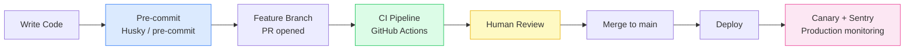

# Engineering Practices — Shared

**Scope:** Repository-level practices that apply to all engineers and AI agents today.

**Note on future repo split:** When frontend and backend are separated into independent repositories, each team copies the documents they need from this folder and maintains their own version. See [`docs/phase2/two-team-ownership.md`](../phase2/two-team-ownership.md) for the split plan.

---

## Guardrail Chain — Development to Production

Every change passes through five layers of automated and human checks before reaching production.

| Layer | Catches | Can be skipped? |
|---|---|---|
| Pre-commit | Lint and format errors on staged files | Yes — `--no-verify` (discouraged) |
| CI Pipeline | Type errors, build failures, test failures, schema drift | No |
| Human review | Intent, logic, design problems no tool can detect | No (branch protection) |
| Canary + Sentry | Runtime failures in production | N/A — always running |

---

## Documents in This Folder

| Document | What it covers |
|---|---|
| [branching-strategy.md](branching-strategy.md) | Feature branch workflow, naming, draft PRs, commit batching, branch protection rules |
| [ai-agent-workflow.md](ai-agent-workflow.md) | Full development-to-production sequence diagram with all guardrail layers |

---

## Team-Specific Practices

| Team | Location |
|---|---|
| Frontend | [`src/docs/engineering-practices/`](../../src/docs/engineering-practices/) |
| Backend | [`backend/docs/engineering-practices/`](../../backend/docs/engineering-practices/) |
