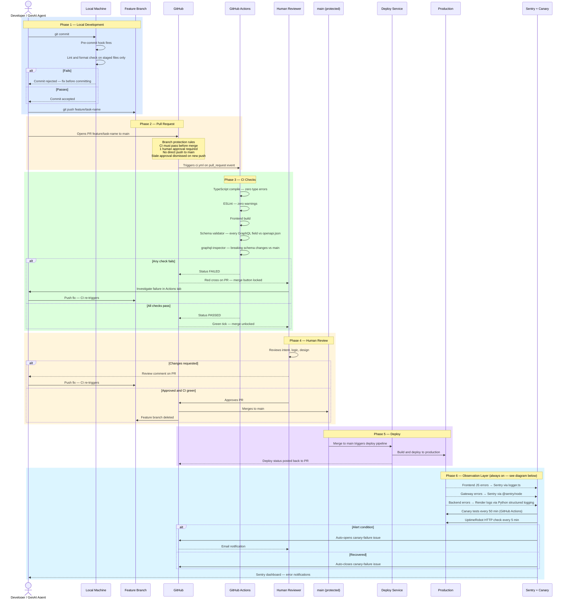
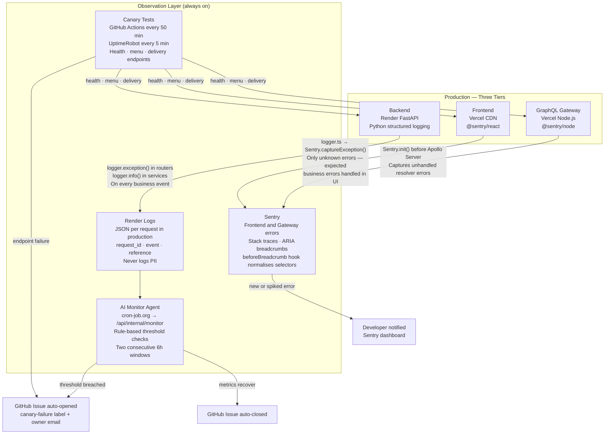
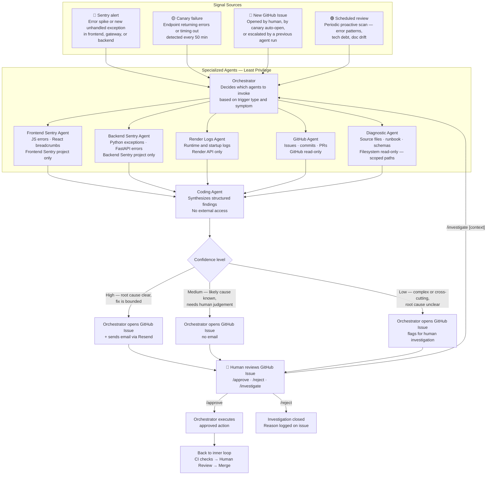

# AI Agent Workflow — Development to Production

**Scope:** All engineers and AI agents working in this repository.
**Last updated:** 2026-04-28
**Agent architecture:** See `docs/engineering-practices/agent-architecture.md` — specialized agents, access matrix, orchestration layer, and least privilege design.
**Agent implementation plan:** See `docs/engineering-practices/agent-execution-plan.md` — phases, tasks, and validation scenarios.

> **Note on CI tooling:** The inner loop diagram shows frontend tools (Husky, ESLint, TypeScript, Vitest). Backend uses pre-commit framework, Black, Flake8, and pytest. The phases and principles are identical — only the tool names differ. When the repo splits, each team copies this file and updates the tool names for their stack.

---

## Two Loops, Not One

The agent participates in two distinct cycles:

- **Inner loop — Execution:** A task is assigned. The agent writes code, opens a PR, CI runs, human reviews, merges. Linear flow from development to production.
- **Outer loop — Operations:** The agent monitors production signals, researches context, and proposes work without being explicitly assigned. A continuous cycle that feeds back into the inner loop.

---

## Inner Loop — Development to Production



---

## Observation Layer

Three independent logging stacks run continuously in production — one per tier. They are always on, independent of deployment events, and feed directly into the outer loop signal sources.



### What each stack captures

| Stack | Tool | Captures | Does not capture |
|---|---|---|---|
| Frontend | `@sentry/react` + `logger.ts` | Unhandled JS exceptions, explicit `logger.error()` calls | Expected business errors (ZIP not covered, sold out) — those are handled in UI |
| Gateway | `@sentry/node` | Unhandled resolver errors, uncaught gateway exceptions | GraphQL user errors (those are returned in the `errors` field, not thrown) |
| Backend | Python `logging` + Render | Every router failure (`logger.exception`), every business event created (`logger.info`) | Frontend and gateway events — each tier owns its own stack |
| Canary | GitHub Actions + UptimeRobot | Endpoint availability and correctness on a schedule | Silent data corruption, logic errors that still return 200 |
| AI Monitor | cron-job.org agent | Error rate trends, latency spikes, notification failure patterns | Anything requiring human design judgement |

---

## Outer Loop — Agent Operations Cycle

The agent does not only execute assigned tasks. It monitors three signal sources continuously and one on a schedule, researches context from multiple sources, and proposes work proactively. Every proposal feeds back into the inner loop.



---

## Signal Sources Explained

| Signal | What triggers it | What the agent reads |
|---|---|---|
| **Sentry error spike** | Error rate exceeds threshold or new unhandled exception | Stack trace, source file at the line, recent commits that may have introduced it |
| **Sentry new error type** | Error class never seen before in production | Where in the codebase this originates, whether tests cover the scenario |
| **Canary failure** | Health, menu, or delivery endpoint fails or times out | Backend logs, recent deployments, historical canary failures for the same endpoint |
| **New GitHub Issue** | Human reports a bug, canary auto-opens, or agent escalates | Issue description, historical issues for similar reports, relevant source files |
| **Scheduled review** | Periodic run | Stale TODOs, test gaps, documentation drift vs current code, recurring error patterns |

---

## What Each Layer Catches

| Layer | Catches | Does not catch |
|---|---|---|
| Pre-commit | Lint and format errors on staged files | Type errors, build failures, whole-project issues |
| CI — build | Compile errors, broken imports, missing modules | Runtime logic errors |
| CI — lint | Lint violations across the whole project | Issues outside lint rule coverage |
| CI — tests | Unit test regressions | Integration failures, end-to-end behaviour |
| CI — schema validator | GraphQL fields missing from backend openapi.json | Runtime data shape mismatches |
| CI — graphql-inspector | Breaking GraphQL schema changes vs main | Non-breaking drift |
| Human review | Intent, logic, and design problems | Anything automated checks already cover |
| Canary + Sentry | Production runtime failures | Pre-production issues |
| **Agent ops loop** | **Error trends, recurring bugs, doc drift — patterns CI cannot see** | **Issues requiring human design judgement** |

---

## Recommended Behaviour for a GenAI Agent

**When executing an assigned task (inner loop):**
1. Pull `main` before branching — never branch from stale code
2. Create a feature branch per task — never commit directly to `main`
3. Batch all changes for a task into one PR — one task, one PR, one review cycle
4. Open as Draft PR if work is incremental — get CI feedback before requesting review
5. Wait for CI to pass before requesting human review
6. Fix the root cause of CI failures — do not push workarounds

**When operating autonomously (outer loop):**
1. Always read historical issues before proposing a fix — the pattern may be known
2. Always read the relevant source files — do not propose changes based on issue title alone
3. Open a Draft PR for bounded fixes; open a GitHub Issue for anything requiring human judgement
4. Include your full diagnosis in the PR or issue — the human should not have to re-investigate
5. Never merge without human approval — the outer loop proposes, the human decides

---

## Implementation Constraint — Selective Context Loading

The outer loop is implemented as a fleet of specialized agents under an orchestration layer, not a single agent that loads everything. Each specialized agent has access only to the systems it needs (least privilege) and loads only what is relevant to its task. See `docs/agent-architecture.md` for the full agent catalog, access matrix, and orchestration flow.

The rule within each agent: **start lean, load incrementally, stop when the finding is complete.**

```
Sentry Agent: load only the error summary for the relevant time window
  → if stack trace points to a file, load only that file's relevant section
  → return structured findings to the orchestrator — stop there

Diagnostic Agent: load only the file or symbol named by the orchestrator
  → trace one level at a time — component → hook → query → resolver
  → return the trace — stop there
```

Specialization enforces least privilege by design — a Sentry Agent cannot read source files, a Diagnostic Agent cannot read Sentry. This is a security and reliability property, not just a performance one. The orchestrator synthesizes findings across agents; no single agent needs the full picture.

See [`docs/phase2/agentic-workflows.md`](../phase2/agentic-workflows.md) for agent guardrails (security, blast radius, cost caps) and the operational incident loop design.

---

## Note on Future Repo Split

When frontend and backend move to separate repositories, each team copies this file and updates the CI tool names in the inner loop diagram for their stack. The two-loop structure, signal sources, investigation phase, and agent behaviour rules apply equally to both teams.
