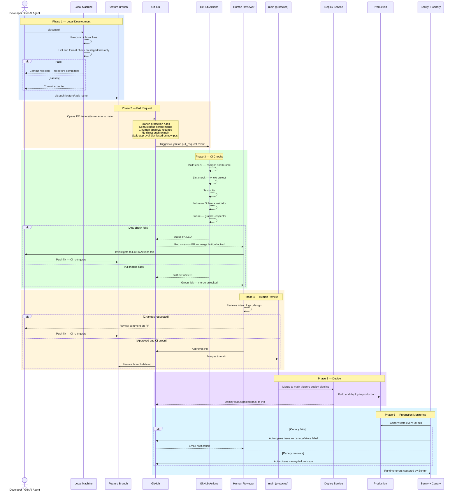
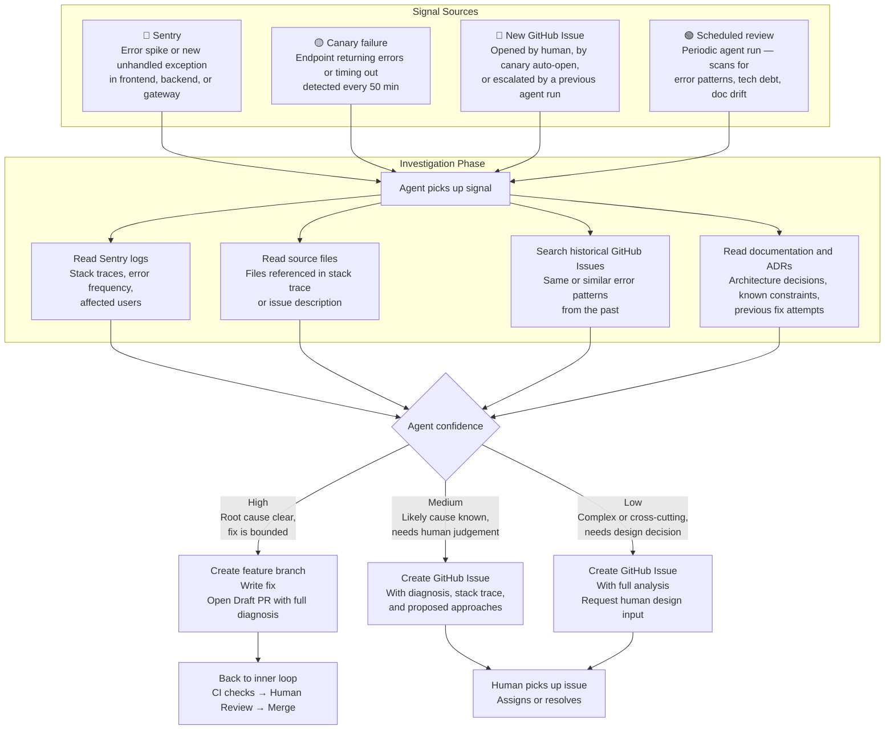

# AI Agent Workflow — Development to Production

**Scope:** All engineers and AI agents working in this repository.
**Last updated:** 2026-04-24

> **Note on CI tooling:** The inner loop diagram shows frontend tools (Husky, ESLint, TypeScript, Vitest). Backend uses pre-commit framework, Black, Flake8, and pytest. The phases and principles are identical — only the tool names differ. When the repo splits, each team copies this file and updates the tool names for their stack.

---

## Two Loops, Not One

The agent participates in two distinct cycles:

- **Inner loop — Execution:** A task is assigned. The agent writes code, opens a PR, CI runs, human reviews, merges. Linear flow from development to production.
- **Outer loop — Operations:** The agent monitors production signals, researches context, and proposes work without being explicitly assigned. A continuous cycle that feeds back into the inner loop.

---

## Inner Loop — Development to Production

---

## Outer Loop — Agent Operations Cycle

The agent does not only execute assigned tasks. It monitors three signal sources continuously and one on a schedule, researches context from multiple sources, and proposes work proactively. Every proposal feeds back into the inner loop.

---

## Signal Sources Explained

| Signal | What triggers it | What the agent reads |
|---|---|---|
| **Sentry error spike** | Error rate exceeds threshold or new unhandled exception | Stack trace, source file at the line, recent commits that may have introduced it |
| **Sentry new error type** | Error class never seen before in production | Where in the codebase this originates, whether tests cover the scenario |
| **Canary failure** | Health, menu, or delivery endpoint fails or times out | Backend logs, recent deployments, historical canary failures for the same endpoint |
| **New GitHub Issue** | Human reports a bug, canary auto-opens, or agent escalates | Issue description, historical issues for similar reports, relevant source files |
| **Scheduled review** | Periodic run | Stale TODOs, test gaps, documentation drift vs current code, recurring error patterns |

---

## What Each Layer Catches

| Layer | Catches | Does not catch |
|---|---|---|
| Pre-commit | Lint and format errors on staged files | Type errors, build failures, whole-project issues |
| CI — build | Compile errors, broken imports, missing modules | Runtime logic errors |
| CI — lint | Lint violations across the whole project | Issues outside lint rule coverage |
| CI — tests | Unit test regressions | Integration failures, end-to-end behaviour |
| CI — schema validator *(future)* | GraphQL fields missing from backend openapi.json | Runtime data shape mismatches |
| CI — graphql-inspector *(future)* | Breaking GraphQL schema changes vs main | Non-breaking drift |
| Human review | Intent, logic, and design problems | Anything automated checks already cover |
| Canary + Sentry | Production runtime failures | Pre-production issues |
| **Agent ops loop** | **Error trends, recurring bugs, doc drift — patterns CI cannot see** | **Issues requiring human design judgement** |

---

## Recommended Behaviour for a GenAI Agent

**When executing an assigned task (inner loop):**
1. Pull `main` before branching — never branch from stale code
2. Create a feature branch per task — never commit directly to `main`
3. Batch all changes for a task into one PR — one task, one PR, one review cycle
4. Open as Draft PR if work is incremental — get CI feedback before requesting review
5. Wait for CI to pass before requesting human review
6. Fix the root cause of CI failures — do not push workarounds

**When operating autonomously (outer loop):**
1. Always read historical issues before proposing a fix — the pattern may be known
2. Always read the relevant source files — do not propose changes based on issue title alone
3. Open a Draft PR for bounded fixes; open a GitHub Issue for anything requiring human judgement
4. Include your full diagnosis in the PR or issue — the human should not have to re-investigate
5. Never merge without human approval — the outer loop proposes, the human decides

---

## Note on Future Repo Split

When frontend and backend move to separate repositories, each team copies this file and updates the CI tool names in the inner loop diagram for their stack. The two-loop structure, signal sources, investigation phase, and agent behaviour rules apply equally to both teams.
