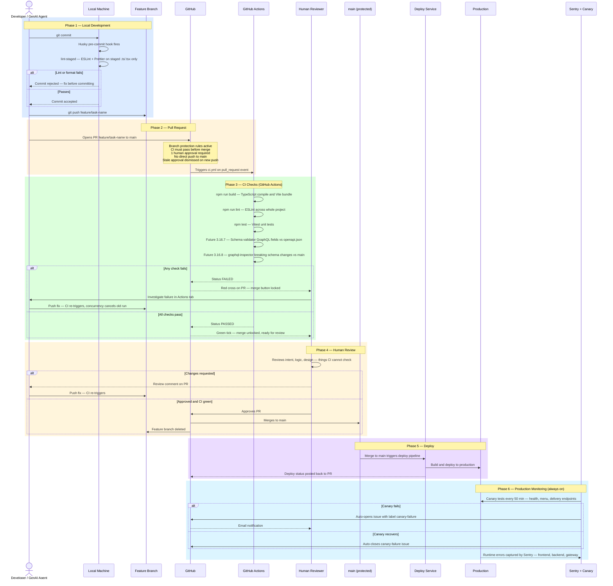

# AI Agent Workflow — Development to Production

**Scope:** All engineers and AI agents working in this repository.
**Last updated:** 2026-04-24

---

## Why Guardrails Matter More for AI-Generated Code

A human engineer typically opens a few PRs per day. An AI agent can open many PRs in rapid succession. Even a small error rate (say, 5%) becomes a real problem at volume — one broken change every twenty PRs reaching production without checks is unacceptable.

Guardrails exist so that:
- **Objective failures** (type errors, broken builds, schema drift) are caught automatically, without human effort
- **Human review** focuses on what only a human can judge: intent, logic, design quality
- **The combination** — automated checks + human approval — is stronger than either alone

---

## Full Guardrail Chain — Development to Production

---

## What Each Layer Catches

| Layer | Catches | Does not catch |
|---|---|---|
| Pre-commit (Husky) | Lint errors and formatting on staged files only | Type errors, build failures, whole-project issues |
| CI — build | TypeScript compile errors, broken imports, missing modules | Runtime logic errors |
| CI — lint | ESLint violations across the whole project | Issues in files not covered by lint rules |
| CI — tests | Unit test regressions | Integration failures, end-to-end behaviour |
| CI — schema validator *(future)* | GraphQL fields not present in backend openapi.json | Runtime data shape mismatches |
| CI — graphql-inspector *(future)* | Breaking GraphQL schema changes vs main | Non-breaking drift |
| Human review | Intent problems, logic errors, design issues | Anything automated checks already covered |
| Canary + Sentry | Production runtime failures | Pre-production issues |

---

## Recommended Behaviour for a GenAI Agent

1. **Create a feature branch per task** — never commit directly to `main`
2. **Batch all changes for a task into one PR** — do not open a PR per commit
3. **Open as Draft PR if work is incremental** — get CI feedback without triggering a review
4. **Wait for CI to pass before requesting human review** — do not request review on a failing PR
5. **Address CI failures before pushing a new commit** — do not push workarounds; fix the root cause
6. **One task, one PR, one review cycle** — keeps the review queue manageable for the human

---

## Note on Future Repo Split

When frontend and backend are separated into independent repositories, each team maintains their own copy of this document, updated to reflect their specific CI checks and deploy pipeline. The principles — automated gates before human review, human review before merge, monitoring after deploy — remain the same.
