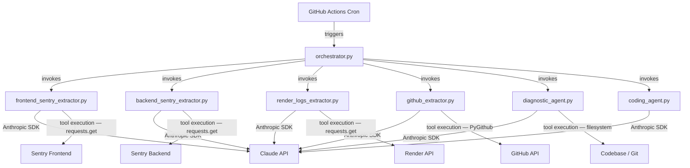
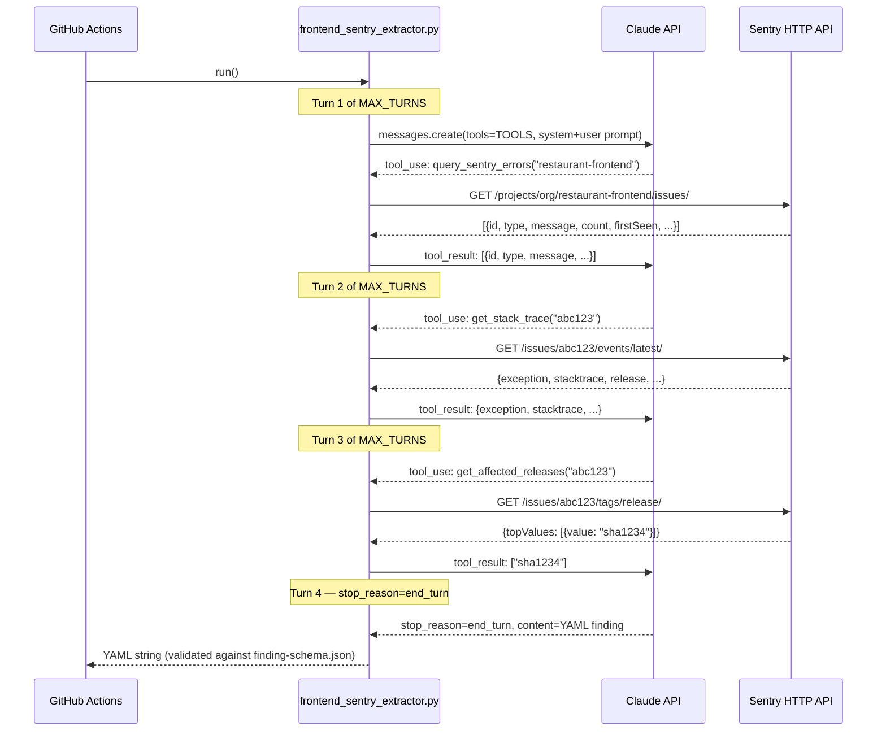
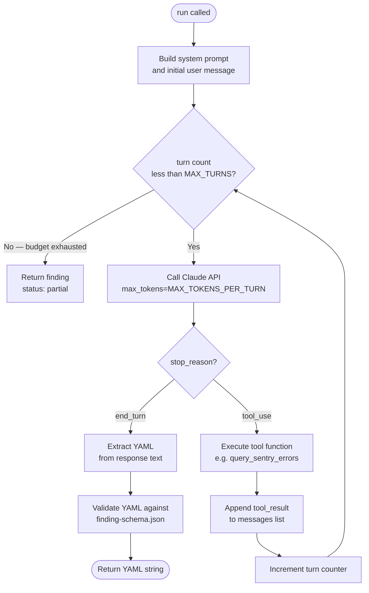
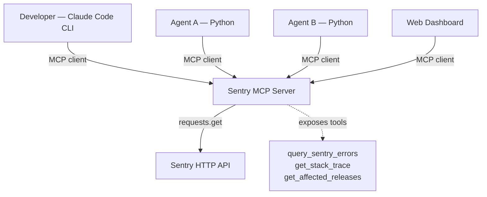
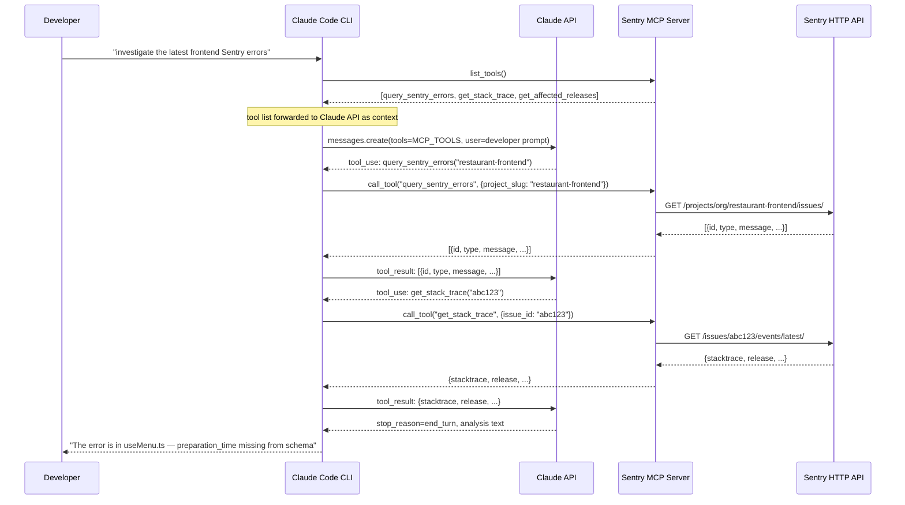

# MCP Servers vs SDK Agents — When to Use Which

**Audience:** Engineers building AI-assisted tooling on this project.
**Context:** This document uses the Aap ki Rasoi observation layer as the running example.
**Reference:** See `agent-architecture.md` for the full agent design and `agent-execution-plan.md` for build status.

---

## Index

| Section | Description |
|---|---|
| [The Core Difference](#the-core-difference) | One-paragraph mental model for each pattern |
| [Pattern 1 — SDK Agents with Tools](#pattern-1--sdk-agents-with-tools) | How it works, architecture, sequence diagram, loop flow |
| [Pattern 2 — MCP Server with Tools](#pattern-2--mcp-server-with-tools) | How it works, architecture, sequence diagram |
| [Side-by-Side Comparison](#side-by-side-comparison) | Decision table |
| [Decision Guide](#decision-guide) | Four questions that lead you to the right choice |
| [Our Codebase — What We Built and Why](#our-codebase--what-we-built-and-why) | Specific decisions made in this project |
| [When MCP Would Make Sense Here](#when-mcp-would-make-sense-here) | Honest look at where MCP could add value |

---

## The Core Difference

**SDK Agent:** Your Python script calls the Claude API. Claude tells your script which function to call. Your script calls the function, gets the result, passes it back to Claude. All of this happens inside one Python process. Claude never touches Sentry, GitHub, or Render — your code does, on Claude's instruction.

**MCP Server:** Your tools live in a separate, long-running server process. Any MCP-compatible client (Claude Code CLI, a Python agent, a web app) can connect to that server and call its tools. The protocol between client and server is standardised — the client doesn't care how the server is implemented.

The fundamental question: **is the tool embedded in one agent, or shared across many clients?**

---

## Pattern 1 — SDK Agents with Tools

### How It Works

1. Your agent script starts an Anthropic SDK client and defines a `TOOLS` list describing the functions it can call.
2. It sends an initial message to the Claude API along with the `TOOLS` list.
3. The API responds with a `tool_use` block — a structured instruction like: *"call `query_sentry_errors` with `project_slug='restaurant-frontend'`"*.
4. Your script executes that Python function (making the actual HTTP call to Sentry).
5. Your script sends the result back to the API as a `tool_result` message.
6. Steps 3–5 repeat until the API responds with `stop_reason == "end_turn"`, meaning Claude has enough information and has written the final output.
7. Your script receives the YAML finding and returns it to the caller.

The Claude API never makes a network call to Sentry. It only sees the text your script sends it. All real I/O happens in your Python functions.

### Architecture



Key point: every agent calls the Claude API for reasoning, then executes tool calls itself. `coding_agent.py` has no external tools — it receives findings as input text and produces output in one turn.

### Sequence Diagram — Frontend Sentry Agent



### Agentic Loop Flow

This flowchart shows what happens inside `run()` — the loop your Python code runs on every agent. `MAX_TURNS` and `MAX_TOKENS_PER_TURN` are the guardrails from `agents/config.py`.



Two exit paths: normal (`end_turn` — Claude finished) and budget-exhausted (`status: partial` — something went wrong or the problem was too complex). The orchestrator handles both.

---

## Pattern 2 — MCP Server with Tools

### How It Works

1. You write a standalone server (Node.js or Python) that implements the MCP protocol and exposes a set of tools.
2. The server runs as a persistent process (or is started on demand via stdio).
3. Any MCP-compatible client — Claude Code CLI, the Anthropic SDK with MCP client support, a web app — connects to the server and discovers its tools automatically.
4. When a client asks Claude to use a tool, Claude sends a `tool_use` request to the client. The client forwards it to the MCP server via the MCP protocol. The server executes the tool and returns the result.
5. Multiple clients can connect to the same server simultaneously without any code duplication.

The key addition is the **MCP protocol layer** between your tool code and the client. Tools become a shared service rather than embedded code.

### Architecture



Key point: tool code lives in exactly one place — the MCP server. Every client uses the same implementation.

### Sequence Diagram — Developer investigating interactively via Claude Code



Key difference from the SDK pattern: Claude Code acts as the MCP client — it discovers tools from the server, forwards them to the Claude API, executes the tool calls the API requests, and returns results. The developer never writes a loop; Claude Code handles it.

---

## Side-by-Side Comparison

| Dimension | SDK Agent with Tools | MCP Server with Tools |
|---|---|---|
| **Where tools live** | Python functions inside the agent script | Separate server process |
| **Who calls the tools** | Your agent's agentic loop | Any MCP-compatible client |
| **Trigger** | Programmatic (CI, cron, API call) | Interactive (Claude Code, web UI) or programmatic |
| **Human in the loop** | Optional — can run fully automated | Natural fit — designed for interactive use |
| **Tool reuse** | Copy code between agents or import a shared module | Connect any client to the same server |
| **Infrastructure** | No extra process — runs inside GitHub Actions | Requires a running server (stdio, SSE, or HTTP) |
| **Debugging** | Single process, standard Python stack traces | Two processes to debug (client + server) |
| **When tool logic changes** | Update the agent script, redeploy | Update the MCP server once, all clients get the fix |
| **Best for** | Automated pipelines, CI/CD, scheduled analysis | Interactive exploration, shared toolsets, developer tools |

---

## Decision Guide

Ask these four questions in order. The first answer that applies gives you the pattern.

**Q1 — Is this triggered automatically (CI, cron, event) with no human starting it?**
Yes → SDK Agent. MCP servers expect a client to connect; automated pipelines don't have one.

**Q2 — Will more than two different clients (agents, CLIs, apps) need the same tools?**
Yes → MCP Server. Sharing via a server is cleaner than copying tool code into every agent.

**Q3 — Does a developer need to explore or investigate interactively using these tools?**
Yes → MCP Server. Claude Code natively supports MCP; it has no native support for your agent scripts.

**Q4 — Are the tools simple HTTP calls used by one agent only?**
Yes → SDK Agent. Wrapping three `requests.get` calls in a server adds infrastructure with no payoff.

---

## Our Codebase — What We Built and Why

Every agent in `agents/` uses the SDK Agent pattern. Here is the reasoning for each.

### Frontend Sentry Agent (`agents/frontend_sentry_extractor.py`)

**Trigger:** GitHub Actions cron fires `sentry-monitor-frontend.yml`, which creates a GitHub issue, which triggers the orchestrator.

**Tool count:** 3 read-only Sentry calls.

**Clients that need these tools:** 1 — only this agent queries the frontend Sentry project.

**Decision:** SDK Agent. Single client, automated trigger, no persistent server needed.

### Backend Sentry Agent (`agents/backend_sentry_extractor.py`)

Same reasoning as frontend. Different Sentry project (`restaurant-backend`), same pattern.

### Render Logs Agent (`agents/render_logs_extractor.py`)

**Trigger:** Orchestrator invokes it when a cold-start pattern is suspected (Sentry shows 503s).

**Tools:** `get_service_logs`, `get_deployment_events` — both are Render API HTTP calls.

**Decision:** SDK Agent. Only the orchestrator ever needs Render logs. No shared server required.

### GitHub Agent (`agents/github_extractor.py`)

**Tools:** `get_issue`, `get_recent_commits`, `get_pr_history` — all read-only GitHub API calls.

**Decision:** SDK Agent. Automated pipeline, single client. Note: if developers ever wanted to query git history interactively via Claude Code, this would be a candidate for MCP.

### Diagnostic Agent (`agents/diagnostic_agent.py`)

**Tools:** `read_file`, `grep_symbol`, `git_diff` — filesystem reads scoped to `src/`, `backend/`, `graphql-gateway/`, `docs/`.

**Decision:** SDK Agent. Even though Claude Code itself can read files, the codebase agent applies project-specific scoping rules (allowed directories, symbol tracing logic) that are not worth packaging as an MCP server at this scale.

### Coding Agent (`agents/coding_agent.py`)

**Tools:** None. Receives structured findings from the orchestrator as input text and produces a recommendation. One turn, no tool calls.

**Decision:** SDK Agent (trivially — no tools to expose).

---

## When MCP Would Make Sense Here

This section is honest about where MCP could add real value as this system grows.

### Scenario A — Developer-facing Sentry investigation tool

If engineers start using Claude Code to explore Sentry errors manually (outside of the automated pipeline), extracting a Sentry MCP server would let them type:

```
"What are the top 5 unresolved errors in the frontend Sentry project this week?"
```

...directly in their terminal, with Claude Code calling the same `query_sentry_errors` tool already written in the agent. The MCP server would be the Sentry tool code extracted from the agent scripts; the agent scripts would then connect to that server instead of calling the functions directly.

### Scenario B — Multiple projects needing Sentry access

If a second project (e.g. a mobile app) adopted the same agent pattern and also needed to query Sentry, the Sentry tool code would exist in two repos. Extracting a shared Sentry MCP server eliminates the duplication.

### Scenario C — Non-Python clients

If a TypeScript orchestrator or a web dashboard needed Sentry access, an MCP server lets them connect without rewriting the Python tool code in TypeScript.

**Rule of thumb:** extract to MCP when the same tool is needed by two or more independent clients, or when a developer needs it interactively. Until then, SDK agents are simpler to build, deploy, and debug.
