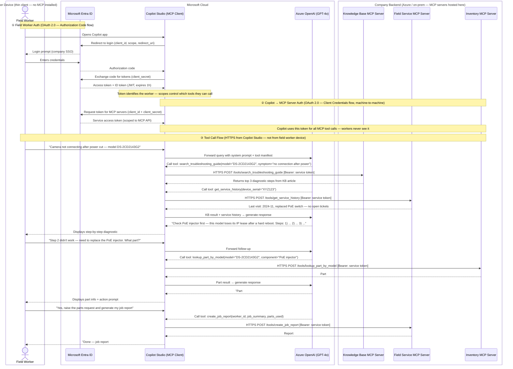
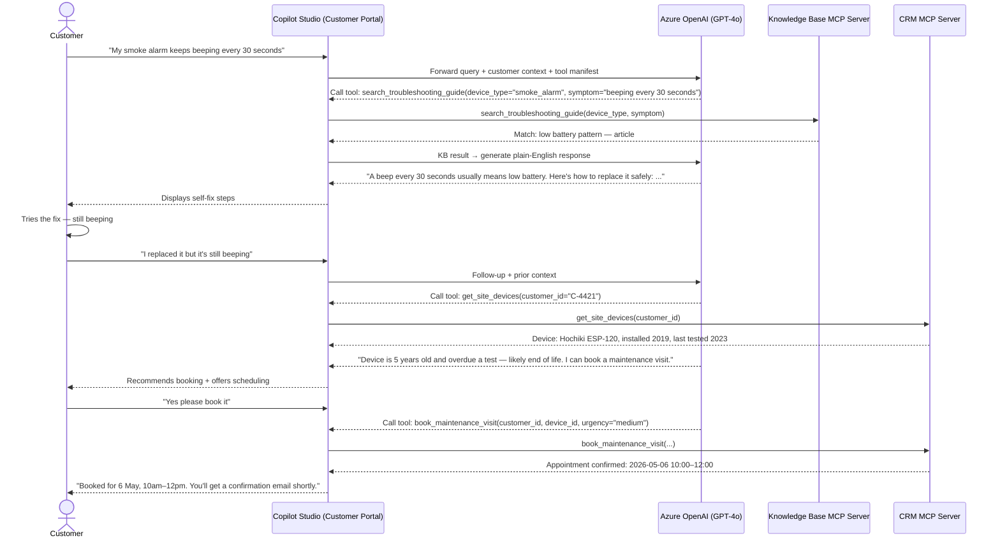

# Side Project — GenAI Field Agent Architecture

## Overview

Field workers and customers interact with a Microsoft Copilot Studio front-end.
Copilot orchestrates a set of MCP (Model Context Protocol) servers that expose domain-specific tools.
Each MCP server is a thin adapter over an existing backend system (CRM, knowledge base, field service, inventory).

---

## Use Cases

### Field Worker Use Cases

| # | Use Case | Description |
|---|---|---|
| FW-1 | AI Troubleshooting Copilot | Describe a symptom → agent walks through a model-specific diagnostic tree, pulling from device manuals and past tickets |
| FW-2 | Installation Guide Assistant | Voice or text query → step-by-step, model-specific wiring and config instructions from product documentation |
| FW-3 | Job Report Generator | Field worker dictates job summary → agent produces a structured completion report (work done, parts used, next service) |
| FW-4 | Parts & Inventory Lookup | Query by symptom or device model → returns part number and van/warehouse stock status |
| FW-5 | Escalation Decision Aid | Agent scores issue severity → recommends self-resolve, Tier-2 escalation, or return visit, and drafts the escalation note |

### Customer (End User) Use Cases

| # | Use Case | Description |
|---|---|---|
| CU-1 | Self-Help Troubleshooting Bot | Customer describes problem → guided resolution steps before raising a support ticket |
| CU-2 | Alarm Response Assistant | Alarm triggers → agent explains what it means, what to do now, and whether to call emergency services |
| CU-3 | Maintenance Scheduler | "Book a camera check" → agent checks contract, finds available slot, confirms appointment |
| CU-4 | Compliance & Audit Report Generator | Agent compiles service history, device test dates, and status into a formatted audit-ready report |

---

## Recommended Starting Points

| Priority | Use Case | Reason |
|---|---|---|
| 1 | FW-1 AI Troubleshooting Copilot | Fastest ROI — cuts callbacks and senior escalations |
| 2 | CU-1 Self-Help Bot | Deflects support tickets at scale |
| 3 | FW-3 Job Report Generator | Saves ~15 min per job; high adoption by field workers |

---

## Solution Architecture

### Components

```
┌─────────────────────────────────────────────────────────────────┐
│                     Microsoft Copilot Studio                    │
│           (Conversation UI — web, mobile, Teams)                │
└──────────────────────────────┬──────────────────────────────────┘
                               │  MCP Tool Calls
           ┌───────────────────┼───────────────────┐
           ▼                   ▼                   ▼
  ┌────────────────┐  ┌────────────────┐  ┌────────────────┐
  │  Knowledge     │  │  Field Service │  │   Inventory    │
  │  Base MCP      │  │  MCP Server    │  │   MCP Server   │
  │  Server        │  │                │  │                │
  └───────┬────────┘  └───────┬────────┘  └───────┬────────┘
          │                   │                   │
          ▼                   ▼                   ▼
  ┌────────────────┐  ┌────────────────┐  ┌────────────────┐
  │  Device Manuals│  │  CRM / Work    │  │  ERP / Parts   │
  │  + KB Articles │  │  Orders / Jobs │  │  Stock System  │
  └────────────────┘  └────────────────┘  └────────────────┘
```

### MCP Servers and Their Tools

| MCP Server | Tools Exposed |
|---|---|
| **Knowledge Base MCP** | `search_troubleshooting_guide`, `get_device_manual`, `get_install_steps` |
| **Field Service MCP** | `get_work_order`, `create_job_report`, `get_service_history`, `draft_escalation` |
| **Inventory MCP** | `lookup_part_by_model`, `check_stock_level`, `find_nearest_warehouse` |
| **CRM MCP** | `get_customer_contract`, `get_site_devices`, `update_ticket_status` |
| **Compliance MCP** | `generate_audit_report`, `get_test_schedule`, `list_compliance_gaps` |

---

## Sequence Diagram — Field Worker Troubleshooting Flow



---

## Sequence Diagram — Customer Self-Help Flow



---

## Key Design Decisions

| Decision | Rationale |
|---|---|
| MCP as the tool layer | Keeps Copilot decoupled from backend systems — each system gets its own server, independently deployable |
| One MCP server per domain | Matches team ownership (field ops, inventory, CRM are separate teams) |
| Copilot Studio as front-end | Meets Microsoft ecosystem requirement; handles auth, Teams integration, and mobile out of the box |
| Azure OpenAI (GPT-4o) as LLM | Required for Microsoft data residency and compliance guarantees in enterprise security/fire safety context |
| Stateless MCP tools | Tools are pure functions — session state lives in Copilot, not in the MCP layer |
