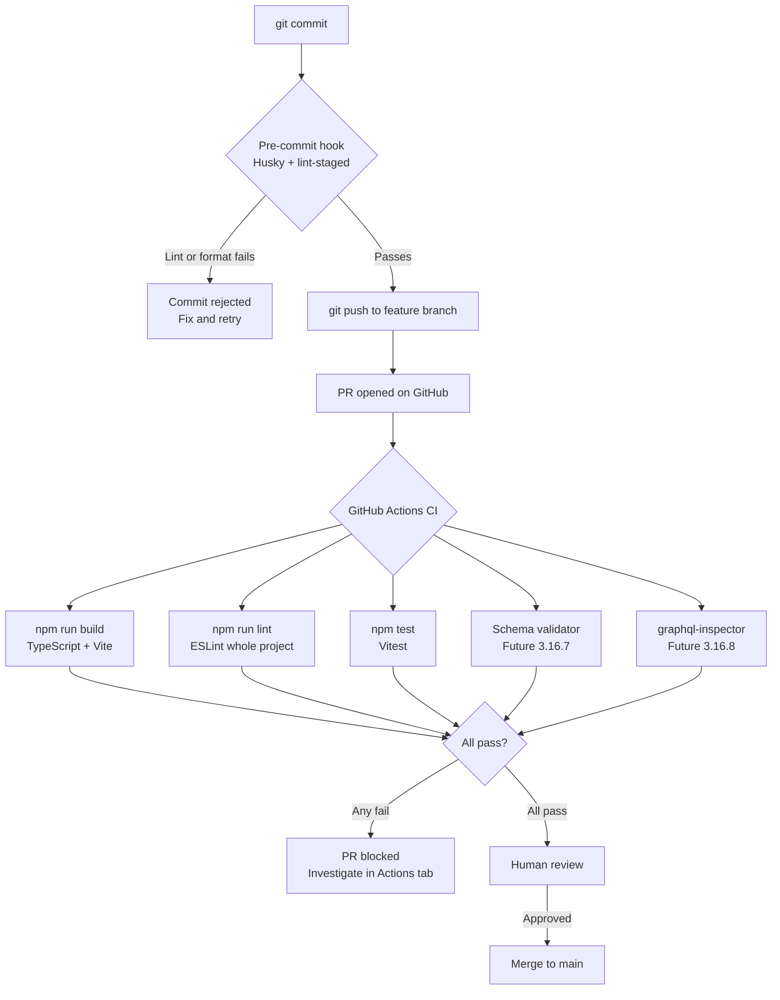

# Engineering Practices — Frontend

**Scope:** Frontend engineers working in `src/` and the GraphQL gateway in `graphql-gateway/`.
**Last updated:** 2026-04-24

---

## Documents

| Document | What it covers |
|---|---|
| [ci-pipeline.md](ci-pipeline.md) | GitHub Actions CI workflow — what runs, how to investigate failures, branch protection setup |
| [pre-commit-hooks.md](pre-commit-hooks.md) | Husky and lint-staged — what runs locally on every commit, setup for new engineers |
| [graphql-guardrails.md](graphql-guardrails.md) | Schema validator and graphql-inspector — catching GraphQL drift before it reaches production |

---

## Related Shared Practices

| Document | Location |
|---|---|
| Branching strategy | [`docs/engineering-practices/branching-strategy.md`](../../../docs/engineering-practices/branching-strategy.md) |
| Full AI agent workflow | [`docs/engineering-practices/ai-agent-workflow.md`](../../../docs/engineering-practices/ai-agent-workflow.md) |

---

## Frontend Guardrail Summary

