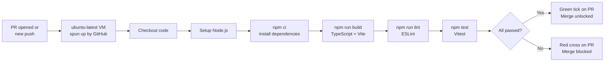

# CI Pipeline — Frontend

**Scope:** Frontend (`src/`) and GraphQL gateway (`graphql-gateway/`).
**Last updated:** 2026-04-24
**Workflow file:** `.github/workflows/ci.yml`

---

## What CI Does and Why

GitHub Actions spins up a clean Ubuntu virtual machine on every push and pull request. It runs the same checks a developer would run locally — but in a clean, reproducible environment that cannot be skipped.

**Why a clean environment matters:** "Works on my machine" is not acceptable. A clean VM catches missing dependencies, environment-specific bugs, and configuration assumptions that only exist on one developer's laptop.

---

## Checks That Run



| Step | Command | What it catches |
|---|---|---|
| Build | `npm run build` | TypeScript type errors, broken imports, missing modules, Vite config issues |
| Lint | `npm run lint` | ESLint violations across the whole project — not just staged files |
| Test | `npm test` | Vitest unit test regressions |
| Schema validator *(future — 3.16.7)* | `node scripts/validate-schema.js` | GraphQL fields missing from backend `openapi.json` |
| graphql-inspector *(future — 3.16.8)* | `graphql-inspector` | Breaking schema changes introduced since last merge |

> **Note:** `npm run build` runs `tsc` as part of the Vite TypeScript plugin. There is no separate TypeScript compile step — build covers it.

---

## Pre-commit vs CI Lint — The Difference

| | Pre-commit (Husky) | CI (GitHub Actions) |
|---|---|---|
| Scope | **Staged files only** | **Whole project** |
| Speed | Fast — seconds | Slower — minutes |
| Skippable | Yes — `git commit --no-verify` | No |
| Catches cross-file issues | No | Yes |
| Visible to team | No | Yes — on the PR |

This is why both exist. Pre-commit gives fast local feedback. CI gives authoritative whole-project enforcement.

---

## Concurrency — Rapid Push Handling

If you push multiple commits quickly to the same branch, CI would naively run for each push. The concurrency group in `ci.yml` cancels the in-progress run when a new push arrives:

```yaml
concurrency:
  group: ci-${{ github.ref }}
  cancel-in-progress: true
```

Only the latest commit on a branch gets a full CI run.

---

## Dependency Caching

`npm install` takes 60–90 seconds without caching. The workflow caches `node_modules` keyed on `package-lock.json`. When the lockfile has not changed, dependencies are restored from cache in under 10 seconds.

Typical CI run times:
- Without cache: ~3–4 minutes
- With cache (lockfile unchanged): ~1–2 minutes

---

## How to Investigate a Failure

1. Open the PR on GitHub
2. Click the red **✗** next to the failing check → **Details**
3. In the Actions tab, expand the failing step
4. Read the error output — it shows the exact file, line number, and error message
5. Fix locally, push the fix — CI re-runs automatically (old run is cancelled by concurrency group)

**Common failures and what they mean:**

| Failure | Likely cause | Where to look |
|---|---|---|
| `npm run build` fails | TypeScript type error or broken import | Expand the build step — `tsc` error includes file + line |
| `npm run lint` fails | ESLint rule violation | Expand lint step — shows rule name and file |
| `npm test` fails | Failing Vitest test | Expand test step — shows test name and assertion |
| `npm ci` fails | `package-lock.json` out of sync | Run `npm install` locally and commit the updated lockfile |

---

## Branch Protection — Making CI a Real Gate

CI alone does not block merging. Configure these rules in **GitHub → Settings → Branches → Add protection rule for `main`**:

| Rule | Setting |
|---|---|
| Require status checks to pass | ✅ On — select `frontend` (the CI job name) |
| Require pull request review | ✅ On — minimum 1 approval |
| Dismiss stale reviews on new push | ✅ On |
| Restrict direct pushes | ✅ On |

Once configured: no green CI + no human approval = merge button locked.

---

## Path Filtering — Skip CI on Non-Code Changes

CI only needs to run when code changes. Documentation-only pushes do not need a full build. The workflow uses `paths` to skip CI when only non-code files change:

```yaml
on:
  push:
    paths:
      - 'src/**'
      - 'graphql-gateway/**'
      - 'package.json'
      - 'package-lock.json'
  pull_request:
    paths:
      - 'src/**'
      - 'graphql-gateway/**'
      - 'package.json'
      - 'package-lock.json'
```

A docs-only commit skips CI entirely and does not consume GitHub Actions minutes.
