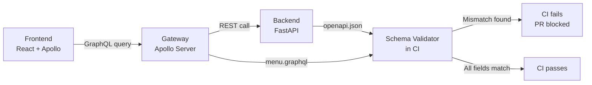
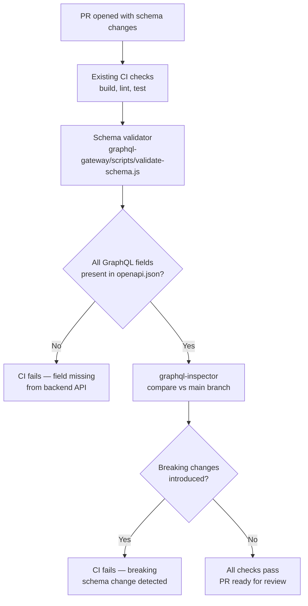

# GraphQL Guardrails

**Scope:** Frontend engineers and the GraphQL gateway (`graphql-gateway/`).
**Last updated:** 2026-04-24
**Status:** Schema validator and graphql-inspector are planned (execution-plan items 3.16.7 and 3.16.8). This document describes the target state.

---

## The Problem These Guardrails Solve

The GraphQL gateway sits between the frontend and the Python backend. The gateway schema is hand-written (`graphql-gateway/schemas/menu.graphql`). The backend exposes its contract via `openapi.json`.

**If they drift apart**, the frontend makes a GraphQL query that the gateway cannot fulfill, or the gateway requests a field from the backend that no longer exists. This produces a runtime error in production that could have been caught in CI.

---

## Layer 1 — Schema Validator (3.16.7)

**What it does:** Checks every field in `menu.graphql` (and future schemas) against the backend `openapi.json`. If a GraphQL field does not exist in the backend API response, CI fails.

**When it runs:** As a step in GitHub Actions CI on every PR that changes `graphql-gateway/schemas/` or `openapi.json`.

**Script location:** `graphql-gateway/scripts/validate-schema.js` *(to be created)*

**What it catches:**
- A field added to the GraphQL schema but not yet in the backend
- A field removed from the backend but still in the GraphQL schema
- A field renamed in the backend without updating the schema

**What it does not catch:**
- Runtime data type mismatches (e.g., backend returns a string where schema expects an integer)
- Logic errors in resolvers

---

## Layer 2 — graphql-inspector (3.16.8)

**What it does:** Compares the current branch's GraphQL schema against the schema on `main`. Detects **breaking changes** — changes that would break existing frontend queries.

**When it runs:** As a step in GitHub Actions CI on every PR.

**What counts as a breaking change:**

| Change | Breaking? | Why |
|---|---|---|
| Remove a field | ✅ Yes | Frontend queries using that field break |
| Change a field type (e.g., `String` → `Int`) | ✅ Yes | Frontend cannot handle the new type |
| Make a nullable field non-nullable | ✅ Yes | Frontend may not send the field |
| Add a new optional field | ❌ No | Existing queries are unaffected |
| Add a new type | ❌ No | Existing queries are unaffected |
| Deprecate a field | ❌ No | Field still works, deprecation is a warning |

**What it does not catch:**
- Semantic changes (field renamed to mean something different but same type)
- Backend behaviour changes that don't affect the schema

---

## How Both Wire into CI

---

## Current State (2026-04-24)

| Item | Status |
|---|---|
| `menu.graphql` schema (hand-written) | ✅ Done |
| Gateway resolver reads from backend | ✅ Done |
| Frontend `useMenu` hook | ✅ Done |
| Schema validator script | ⏳ Planned — 3.16.7 |
| graphql-inspector in CI | ⏳ Planned — 3.16.8 |

Until the validator is in place, schema drift is caught only during manual testing. The validator closes this gap.

---

## Adding a New GraphQL Domain (Orders, Catering, Reservations)

When migrating a new domain to GraphQL (planned in 3.16.10–3.16.12):

1. Write the `.graphql` schema file in `graphql-gateway/schemas/`
2. Write the resolver in `graphql-gateway/resolvers/`
3. The schema validator will automatically check the new schema against `openapi.json` — no extra CI config needed
4. graphql-inspector will detect breaking changes from the first PR onwards

The guardrails extend to new domains automatically because they scan all schema files, not just `menu.graphql`.
