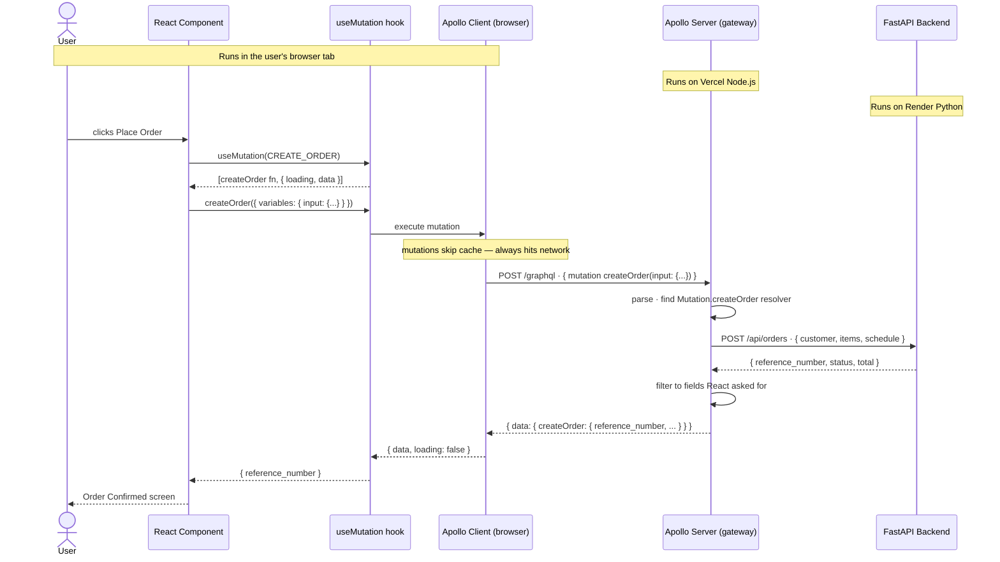

# GraphQL Request Flow

**Scope:** Frontend engineers working with the GraphQL gateway (`graphql-gateway/`).
**Last updated:** 2026-04-25

---

## Where the Code Runs

GraphQL involves two separate Apollo packages running in two separate places.

| Package | Where it runs | Installed in | Responsibility |
|---|---|---|---|
| `@apollo/client` | User's browser | `src/` | Sends queries, caches results, exposes `useQuery` / `useMutation` hooks |
| `@apollo/server` | Vercel Node.js server | `graphql-gateway/` | Receives queries, calls resolvers, filters response |

The user never sees Apollo Server. The frontend team never touches Apollo Client's network internals — they only write `gql` query strings and use hooks.

---

## HTTP Method — The Surprising Part

**React always sends HTTP POST to the gateway — for both queries and mutations.**

GraphQL uses POST for everything. The GET vs POST distinction only appears in the hop between the gateway and FastAPI, where your resolver decides.

| Hop | Method | Decided by |
|---|---|---|
| Browser → Gateway | Always `POST /graphql` | GraphQL spec |
| Gateway → FastAPI | `GET` for reads, `POST` for writes | Your resolver (`fetch` method option) |

---

## Example 1 — Query (menu fetch)

React asks for data. Gateway calls a GET endpoint on the backend.

```
Browser                    Gateway                   FastAPI
   │                          │                          │
   │  POST /graphql            │                          │
   │  { query: "{ menu }" }   │                          │
   │─────────────────────────►│                          │
   │                          │  GET /api/menu           │
   │                          │─────────────────────────►│
   │                          │  200 { categories: [] }  │
   │                          │◄─────────────────────────│
   │  { data: { menu: {} } }  │                          │
   │◄─────────────────────────│                          │
```

**Frontend code:**
```ts
const { data } = useQuery(GET_MENU);
// fires automatically when component renders
// result is cached — second render hits cache, not network
```

**Gateway resolver:**
```ts
Query: {
  menu: async () => {
    const response = await fetch(`${BACKEND_URL}/api/menu`); // GET by default
    return response.json();
  }
}
```

---

## Example 2 — Mutation (place order)

React sends data. Gateway calls a POST endpoint on the backend.

```
Browser                    Gateway                   FastAPI
   │                          │                          │
   │  POST /graphql            │                          │
   │  { mutation:             │                          │
   │    createOrder({...}) }  │                          │
   │─────────────────────────►│                          │
   │                          │  POST /api/orders        │
   │                          │  { customer, items... }  │
   │                          │─────────────────────────►│
   │                          │  201 { reference_number }│
   │                          │◄─────────────────────────│
   │  { data: {               │                          │
   │    createOrder: {        │                          │
   │      reference_number }} │                          │
   │◄─────────────────────────│                          │
```

**Frontend code:**
```ts
const [createOrder, { data, loading }] = useMutation(CREATE_ORDER);
// does NOT fire automatically — returns a function
// call createOrder({ variables: { input: {...} } }) on button click
```

**Gateway resolver:**
```ts
Mutation: {
  createOrder: async (_, { input }) => {
    const response = await fetch(`${BACKEND_URL}/api/orders`, {
      method: "POST",          // explicitly POST — write operation
      headers: { "Content-Type": "application/json" },
      body: JSON.stringify(input),
    });
    return response.json();
  }
}
```

---

## Query vs Mutation — Key Differences

| | Query | Mutation |
|---|---|---|
| Purpose | Read data | Write data |
| Hook | `useQuery` | `useMutation` |
| When it fires | Automatically on render | Only when you call the returned function |
| Apollo cache | Result is cached | Always goes to network — never cached |
| Backend HTTP method | `GET` (by convention) | `POST` / `PUT` / `PATCH` (by convention) |
| GraphQL schema keyword | `type Query` | `type Mutation` |
| Input data | Arguments (optional) | `input` type (required for complex data) |

---

## Full Sequence — Order Placement

End-to-end view including caching behaviour and the browser/server boundary.



---

## What the Schema Does in This Flow

The `.graphql` schema file is the contract that makes Steps 2–3 safe:

- **React** can only ask for fields that exist in the schema — Apollo Client validates the query at build time via codegen
- **Gateway** rejects any query referencing a non-existent field before calling the resolver
- **CI** catches schema drift between the gateway schema and the backend `openapi.json`

See [graphql-guardrails.md](graphql-guardrails.md) for how the CI validation works.
