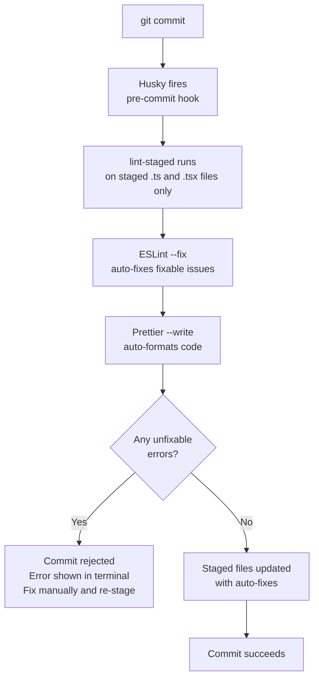

# Pre-Commit Hooks — Frontend

**Scope:** Frontend engineers working in `src/`.
**Last updated:** 2026-04-24
**Tools:** Husky 9.x + lint-staged 16.x

---

## What Happens on Every Commit



Only **staged files** are checked. Files you have edited but not staged are not touched.

---

## What Is Checked

| Tool | What it does | Auto-fixes? |
|---|---|---|
| ESLint | Checks TypeScript / TSX code for rule violations | Partially — fixable rules auto-fix; logic errors do not |
| Prettier | Enforces consistent code formatting | Yes — always rewrites the file |

Configuration:
- ESLint: `eslint.config.js` at the project root
- Prettier: `prettier.config.js` or `"prettier"` key in `package.json`
- lint-staged: `"lint-staged"` key in `package.json`

```json
"lint-staged": {
  "*.{ts,tsx}": [
    "eslint --fix",
    "prettier --write"
  ]
}
```

---

## Why Only Staged Files?

Running ESLint across the entire project on every commit would take 15–30 seconds. Checking only staged files keeps the pre-commit hook under 3 seconds for a typical commit.

The full-project ESLint check runs in CI (`npm run lint`) where speed is less critical and a clean environment ensures nothing is missed.

| | Pre-commit | CI |
|---|---|---|
| Scope | Staged files only | Whole project |
| Speed | Fast — seconds | Slower — minutes |
| Purpose | Developer feedback loop | Authoritative enforcement |

---

## Setup for New Engineers

After cloning the repository, run:

```bash
npm install
```

Husky is installed automatically via the `prepare` script in `package.json`:

```json
"scripts": {
  "prepare": "husky"
}
```

`npm install` runs `prepare`, which installs the Git hooks into `.git/hooks/`. No manual step required.

**Verify the hook is installed:**
```bash
cat .husky/pre-commit
# Should output: npx lint-staged
```

---

## Bypassing the Hook (Discouraged)

```bash
git commit --no-verify -m "message"
```

This skips Husky entirely. **Do not use this to push broken code.** The only acceptable use is committing a work-in-progress for backup when the hook is itself broken (e.g., misconfigured ESLint crashing).

CI will still run the full lint check — bypassing pre-commit does not bypass CI.

---

## Common Issues

| Issue | Cause | Fix |
|---|---|---|
| `npx lint-staged` not found | `npm install` was not run after clone | Run `npm install` |
| Hook fires but does nothing | No `.ts`/`.tsx` files staged | Expected — only code files are checked |
| ESLint exits with unfixable error | A lint rule violation that cannot be auto-fixed | Read the error, fix the code manually |
| Prettier reformats a file unexpectedly | Code style diverged from Prettier config | Accept the reformat — it is correct |
